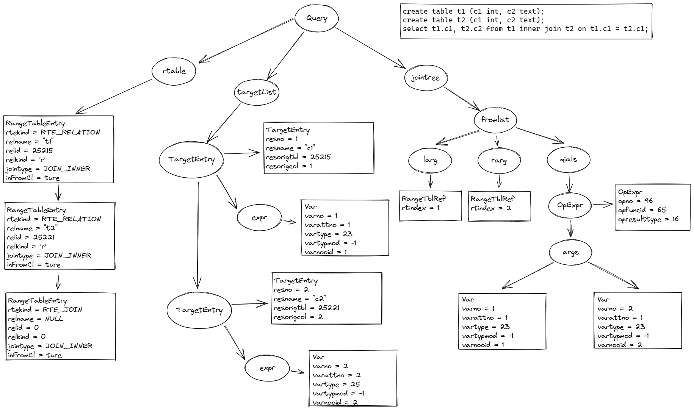

# SQL 执行流程

```exec_simple_query(const char *query_string)``` 函数为执行 SQL 的入口。

整个流程大致如下：

```c
/*
 * exec_simple_query
 *
 * Execute a "simple Query" protocol message.
 */
void exec_simple_query(const char *query_string)
{
    /*
     * Start up a transaction command.  All queries generated by the
     * query_string will be in this same command block, *unless* we find a
     * BEGIN/COMMIT/ABORT statement; we have to force a new xact command after
     * one of those, else bad things will happen in xact.c. (Note that this
     * will normally change current memory context.)
     */
    start_xact_command();

    /*
     * Do basic parsing of the query or queries (this should be safe even if
     * we are in aborted transaction state!)
     */
    parsetree_list = pg_parse_query(query_string);

    foreach(parsetree_item, parsetree_list)
    {
        /* Make sure we are in a transaction command */
        start_xact_command();

        querytree_list = pg_analyze_and_rewrite_fixedparams(parsetree, query_string,
                                                        NULL, 0, NULL);

        plantree_list = pg_plan_queries(querytree_list, query_string,
                                        CURSOR_OPT_PARALLEL_OK, NULL);
        
        /*
		 * We don't have to copy anything into the portal, because everything
		 * we are passing here is in MessageContext or the
		 * per_parsetree_context, and so will outlive the portal anyway.
		 */
		PortalDefineQuery(portal,
						  NULL,
						  query_string,
						  commandTag,
						  plantree_list,
						  NULL);

		/*
		 * Select the appropriate output format: text unless we are doing a
		 * FETCH from a binary cursor.  (Pretty grotty to have to do this here
		 * --- but it avoids grottiness in other places.  Ah, the joys of
		 * backward compatibility...)
		 */
		format = 0;				/* TEXT is default */
		if (IsA(parsetree->stmt, FetchStmt))
		{
			FetchStmt  *stmt = (FetchStmt *) parsetree->stmt;

			if (!stmt->ismove)
			{
				Portal		fportal = GetPortalByName(stmt->portalname);

				if (PortalIsValid(fportal) &&
					(fportal->cursorOptions & CURSOR_OPT_BINARY))
					format = 1; /* BINARY */
			}
		}
		PortalSetResultFormat(portal, 1, &format);

		/*
		 * Now we can create the destination receiver object.
		 */
		receiver = CreateDestReceiver(dest);
		if (dest == DestRemote)
			SetRemoteDestReceiverParams(receiver, portal);

		/*
		 * Switch back to transaction context for execution.
		 */
		MemoryContextSwitchTo(oldcontext);

		/*
		 * Run the portal to completion, and then drop it (and the receiver).
		 */
		(void) PortalRun(portal,
						 FETCH_ALL,
						 true,	/* always top level */
						 true,
						 receiver,
						 receiver,
						 &qc);

		receiver->rDestroy(receiver);

		PortalDrop(portal, false);
        
        finish_xact_command();
    }
    
    finish_xact_command();
}
```

### 事务

在函数的开始会调用函数```start_xact_command()```来开启事务，结束处会调用```finish_xact_command()```来关闭事务，而在`start_xact_command()` 和 `finish_xact_command()`内部实际上是通过`StartTransactionCommand()`和`CommitTransactionCommand()`来开启和关闭一个事务的。

### 词法解析和语义解析

`pg_parse_query(query_string)`函数将会通过词法解析、语法解析将字符串解析为语法树（AST树）并返回，这部分详细规则可参照另一篇文章。

### 语义解析和规则重写

此时我们获得了语法树，接着调用` pg_analyze_and_rewrite_fixedparams(parsetree, query_string, NULL, 0, NULL)`来对语法树进行语义解析和规则重写，并返回一颗查询树（Query Tree）。在这个过程中包含两个部分：语义分析、规则重写。

1. 语义分析：通过`parse_analyze_fixedparams(parsetree, query_string, NULL, 0, NULL)`进入，随后调用`transformTopLevelStmt(pstate, parseTree)`生成查询树（Query Tree）。如果 SELECT 有 INTO ，则`transformTopLevelStmt`先将其转换为 CREATE TABLE AS，再调用`transformStmt(pstate, parseTree)`来进行处理。注意：`transformStmt`内会调用`transformXXX`形式的各种函数来依次对语法树（AST树）中的各个节点和变量进行处理，将其转化为查询树（Query Tree）中的形式。

    其中`ParseState *pstate`表示的是解析过程中处理的结果，生成的中间信息会先保存在这个结构体中，因为有的结果并不是查询树（Query Tree）需要的结果，查询树需要的结果可能是后面再处理后的。等最后获取的差不多的时候再根据`pstate`中的信息生成查询树中的信息。

    在语义解析中会将语法树中的rtable、jointable的OID等信息放入查询树中，这个过程需要查表也就是打开表，是通过`parserOpenTable`函数来完成的。其他的信息则是通过查询系统表来实现的。

2. 规则重写：通过`pg_rewrite_query(query)`进入，随后调用`QueryRewrite(query)`去重写这颗查询树。重写器只会重写`select`、`update`、`insert`、`delete`、`merge`语句。当存在CREATE VIEW或者CREATE RULE创建的SELECT或者non-SELECT规则时，会使用pg_rule系统表中的规则进行替换。

    `rewriteTargetListIU`重写INSERT/UPDATE的`targetlist`为标准形式。

    `fireRIRrules`重写`rable`。

给出一颗解析后的查询树（Query Tree）如下所示。



#### rtable

其中`rable`表示范围表，会将整个过程中用到的表全部放入。

* `RTE_RELATION`表示这是一个关系，即实际存在的一个表。
* `RTE_CTE`表示这是WITH语句中生成的范围表。
* `RTE_JOIN`表示这是JOIN后生成的范围表。
* `RTE_VALUES`表示VALUES后的信息
* ...

不管`rtable->rtekind`是什么类型，它们都表示某个来源生成的一个结果集，而这个结果集存在`rtable`中。

#### 关键函数

- transformExpr：分析和转换表达式。

- coerce_to_target_type：将表达式转换为目标类型和 typmod。

### 生成计划

此时我们获得了查询树，我们需要将其转化为执行计划。入口为`pg_plan_query()->planner()->standard_planner()`。在`standard_planner`中做了一些辅助工作，然后调用`subquery_planner`进入生成计划的入口。