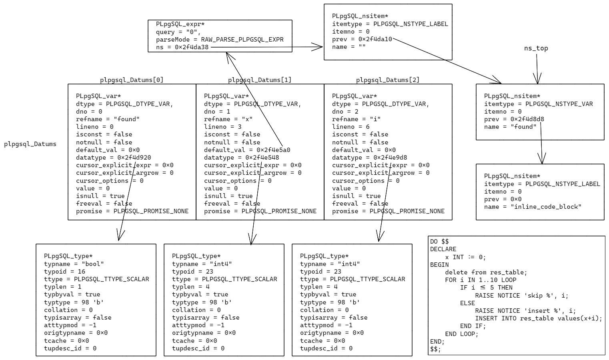

# PL/pgSQL

**PL/pgSQL（Procedural Language / Postgres Structured Query Language）**是一种用于 PostgreSQL 数据库系统的可载入的过程语言。

代码中位于 plpgsql 目录下。

## 入口

PL/pgSQL 的入口位于 `pl_handler.c` 文件，包括：

* `plpgsql_call_handler()` 函数是处理存储过程、函数和触发器的入口。
* `plpgsql_inline_handler()` 函数是执行匿名块的入口。
* `plpgsql_validator()` 函数是用来验证在创建存储过程、函数和触发器时语法是否正确的入口。

下面会对匿名块的流程进行详细说明。因为匿名块的执行只包含编译、执行，不涉及对该函数的存储、也不涉及触发器等，比较好理解。存储过程、函数和触发器的执行流程与它相似。

考虑如下匿名块：

```sql
-- 创建一个表存储匿名块结果
CREATE TABLE res_table (
    res INT NOT NULL
);

-- 清空 res_table，并插入 6, 7, 8, 9, 10
DO $$
DECLARE
    x INT := 0;
BEGIN
    delete from res_table;
    FOR i IN 1..10 LOOP
        IF i <= 5 THEN
            RAISE NOTICE 'skip %', i;
        ELSE
            RAISE NOTICE 'insert %', i;
            INSERT INTO res_table values(x+i);
        END IF;
    END LOOP;
END;
$$;
```

匿名块的执行入口依次为 `standard_ProcessUtility() -> ExecuteDoStmt() -> plpgsql_inline_handler()` 。

在 gram.y 文件中语法解析时，会把匿名块 `as` 后一直到 `$$` 的语句单独保存。在 `ExecuteDoStmt()` 中会将需要的信息保存到 `InlineCodeBlock *codeblock` 中传递给`plpgsql_inline_handler()`。比如当前匿名块的该结构体的值就如下所示：

```c
*codeblock = {
    type = T_InlineCodeBlock,
    source_text = "
        DECLARE
            x INT := 0;
        BEGIN
            delete from res_table;
            FOR i IN 1..10 LOOP
                IF i <= 5 THEN
                    RAISE NOTICE 'skip %', i;
                ELSE
                    RAISE NOTICE 'insert %', i;
                    INSERT INTO res_table values(x+i);
                END IF;
            END LOOP;
        END;
    ",
    langOid = 13680,
    langIsTrusted = true,
    atomic = false
}
```

其中，`source_text` 记录了 plpgsql 后面需要解析的语句；`atomic` 表示是否需要原子地去执行这个匿名块。

`plpgsql_inline_handler()` 函数比较简单，主要做的工作为

1. 连接 SPI 管理器。
2. 编译 `codeblock->source_text`，返回执行函数。
3. 初始化环境，运行执行函数。
4. 如果第 3 步出错，清理环境，抛出错误。
5. 如果第 3 步成功，清理环境，关闭 SPI 连接器。

其中较为关键的步骤是第 2 步和第 3 步。第 2 步通过调用接口 `plpgsql_compile_inline()` 编译 plpgsql 语句，第 3 步调用接口 `plpgsql_exec_function()` 执行编译后的语句。

## 编译

匿名块会通过函数 `plpgsql_compile_inline()` 进入编译流程，该函数声明如下：

```c
PLpgSQL_function *
plpgsql_compile_inline(char *proc_source)
```

它的返回值`PLpgSQL_function* function`中存储着后续执行阶段需要的各种信息。

在 `plpgsql_compile_inline()` 中做的事情主要包括如下方面：

1. 初始化 plpgsql 扫描器。

    ```c
    plpgsql_scanner_init(proc_source);
    ```

2. 设置 error 时的报错输出信息。当 error 发生时会依次弹出 `error_context_stack` 内的回调函数，并输出额外的信息。

    ```c
    plerrcontext.callback = plpgsql_compile_error_callback;
    plerrcontext.arg = proc_source;
    plerrcontext.previous = error_context_stack;
    error_context_stack = &plerrcontext;
    ```

3. 为返回值 `function` 分配内存。

    ```c
    function = (PLpgSQL_function *) palloc0(sizeof(PLpgSQL_function));
    plpgsql_curr_compile = function;
    ```

4. 为 plpgsql 的编译过程分配内存上下文，这样方便清理。

    ```c
    func_cxt = AllocSetContextCreate(CurrentMemoryContext,
                                     "PL/pgSQL inline code context",
                                     ALLOCSET_DEFAULT_SIZES);
    plpgsql_compile_tmp_cxt = MemoryContextSwitchTo(func_cxt);
    ```

5. 初始化 `function` 的值。

6. 初始化命名空间 `ns_top` 和变量空间 `plpgsql_Datums`。

    - 命名空间存储着标识符，以及它的标签。主要是用于避免命名冲突。
    - 变量空间存储着语句中定义的所有变量。

    ```c
    plpgsql_ns_init();
    plpgsql_ns_push(func_name, PLPGSQL_LABEL_BLOCK);
    plpgsql_DumpExecTree = false;
    plpgsql_start_datums();
    ```

7. 创建 `FOUND` 变量，并添加进命名空间和变量空间中。

    > 在 PL/pgSQL 中，`FOUND` 是一个特殊的变量，用于表示最后一个 SQL 查询是否返回了至少一行数据。当最后一个 SQL 查询返回至少一行时，`FOUND` 的值为 `TRUE`，否则为 `FALSE`。`FOUND` 变量通常用于检查 SQL 查询的结果，以确定查询是否成功执行。

    ```c
    var = plpgsql_build_variable("found", 0,
                                 plpgsql_build_datatype(BOOLOID,
                                                        -1,
                                                        InvalidOid,
                                                        NULL),
                                 true);
    function->found_varno = var->dno;
    ```

8. 编译。编译结果保存在 `plpgsql_parse_result` 中，将其赋值给 `function->action` 以便执行时使用。

    ```c
    parse_rc = plpgsql_yyparse();
    if (parse_rc != 0)
        elog(ERROR, "plpgsql parser returned %d", parse_rc);
    function->action = plpgsql_parse_result;
    ```

9. 清理环境。

当编译完成后，可以获得如下的命名空间 `ns_top` 和变量空间 `plpgsql_Datums`。



其中 `lineno` 是从 `$$` 的位置开始算的。

## 执行

匿名块的执行在函数`plpgsql_exec_function()` 中。