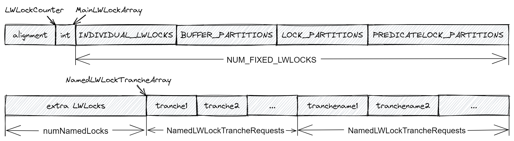
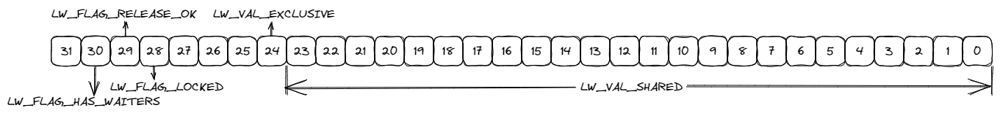
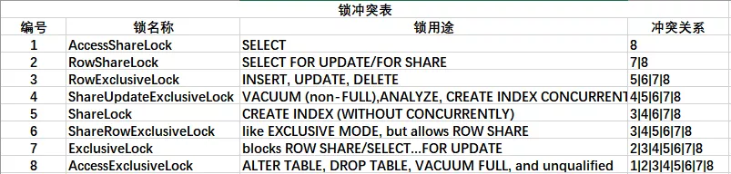

# 锁管理器

PostgreSQL 中定义了四种锁，分别为：SpinLock、LWLock、RegularLock 和 PredicateLock。

## SpinLock

**SpinLock（Spin Lock，自旋锁）**用于非常短期锁定，其显著的特点是死等。 如果一个锁要持有超过几十条指令，或者跨越任何类型的内核调用（甚至是对重要子例程的调用），都不要使用 SpinLock。 SpinLock 主要用作轻量级锁的基础设施。SpinLock 的封锁时间很短，没有等待队列，没有死锁检测、错误自动释放或任何其他细节。如果在一分钟左右后无法获得锁，则会超时（与我们期望的封锁时间相比这太长了，认为是一种错误情况）。

SpinLock 只有互斥一种模式。

SpinLock 的实现在分布在两个文件中，s_lock.c 和 Spin.c。s_lock.c 中的实现与机器相关，如果机器拥有 TAS 指令集，那么 PostgreSQL 会使用其中的实现方法；Spin.c 中的实现与机器无关，PostgreSQL 使用信号量来实现 SpinLock，需要用到 PGSemaphores。其中 s_lock.c 中加锁的接口如下所示：

```c
int
s_lock(volatile slock_t *lock, const char *file, int line, const char *func)
{
	SpinDelayStatus delayStatus;

	/* 初始化SpinLock的状态信息，如spin的次数等 */
	init_spin_delay(&delayStatus, file, line, func);

	/* 尝试获取锁，如果机器支持TAS则使用，否则使用Spin.c提供的接口tas_sema */
	while (TAS_SPIN(lock))
	{
		/*
		 * spins，在cpu级别有一个delay时间，当spin次数
		 * 大于spins_per_delay，在此函数中会随机
		 * 休眠1ms到1s，休眠时间逐渐增加。
		 */
		perform_spin_delay(&delayStatus);
	}
	
	/* 
	 * 获取锁后，根据之前delay的次数调整进入休眠的spin次数。
	 * 如果在获取锁的时候没有休眠过，那么可以把进入休眠spin的次数调大。
	 * 如果休眠过，表示锁竞争大，就把进入休眠spin的次数降低，减少CPU消耗。
	 */
	finish_spin_delay(&delayStatus);
	
	/* 返回等待时间 */
	return delayStatus.delays;
}
```

它们统一通过 spin.h 中的接口调用

```c
#define SpinLockInit(lock)	S_INIT_LOCK(lock)

#define SpinLockAcquire(lock) S_LOCK(lock)

#define SpinLockRelease(lock) S_UNLOCK(lock)

#define SpinLockFree(lock)	S_LOCK_FREE(lock)
```

## LWLock

**LWLock（Lightweight lock，轻量级锁**）通常用于互锁对共享内存中数据结构的访问。 LWLock 支持独占和共享锁模式（用于对共享对象的读/写和只读访问）。 没有提供死锁检测，但 LWLock 管理器会在 elog() 恢复期间自动释放持有的 LWLocks，因此在持有 LWLocks 时引发错误是安全的。 当没有锁争用时，获取或释放 LWLock 非常快（几十条指令）。 当进程必须等待 LWLock 时，它会阻塞在 SysV 信号量上，以免消耗 CPU 时间。 等待进程将按到达顺序授予锁。 没有超时。

LWLock 有共享和互斥两种模式。

LWLock 的实现主要在 lwlock.c 文件中。

### 数据结构及存储

LWLock 的数据结构定义如下：

```c
typedef struct LWLock
{
	uint16		tranche;		/* tranche ID */
	pg_atomic_uint32 state;		/* state of exclusive/nonexclusive lockers */
	proclist_head waiters;		/* list of waiting PGPROCs */
#ifdef LOCK_DEBUG
	pg_atomic_uint32 nwaiters;	/* number of waiters */
	struct PGPROC *owner;		/* last exclusive owner of the lock */
#endif
} LWLock;

/* LWLock 填充到完整的 cache line 大小 */
typedef union LWLockPadded
{
	LWLock		lock;
	char		pad[LWLOCK_PADDED_SIZE];
} LWLockPadded;
```

其中 `tranche` 标记这个 LWLock ，是它的 ID，也可以理解为这是哪一部分的 LWLock。`state` 为一个原子变量，LWLock 的互斥访问通过它来实现。`waiters` 记录了等待 LWLock 的前后进程号。

> Q：为什么 LWLock 需要填充到完整的 cache line 大小？
>
> A：因为这样可以减少 cache contention 的问题。每个 CPU 都有自己的 cache，当某个 CPU 上的线程更新了其中的数据时，需要在 CPU 间通信，更新其他 CPU 的 cache，否则就会出现“脏读”。考虑如下情况：两个不同 CPU 上的线程 T~1~、T~2~，如果 LWLock 的大小没有填充到 cache line，那么在本地 cache 的 cache line 上在存贮着 LWLock 之外还同时着其他数据 x；如果 T~2~ 更新数据 x，根据当前 CPU cache 失效的逻辑，需要重新从共享的内存中把这个 cache line 的数据 load 进来（这个过程是很慢的），而实际上这个cache line 上的 LWLock 并没有被任何其它线程修改过。

在共享内存中有一块内存用来存储基础的 LWLock 的相关信息，这块内存的结构如下所示：



我们使用 **MainLWLockArray** 指针来指向这块内存，它的定义如下所示：

```c
/*
 * 这指向共享内存中的 LWLocks 主数组。 后端通过
 * fork 从 postmaster 继承指针（除了 EXEC_BACKEND 的情况，
 * 我们有特殊的措施来传递它）。
 */
LWLockPadded *MainLWLockArray = NULL;
```

在 `MainLWLockArray` 的前方额外申请 int 大小的空间用来存储 LWLockConunter，用来存储这块内存中总共有多少的 LWLock。

再往后是 LWLocks，它们分为 5 个部分：

1. 第一部分是 `INDIVIDUAL LWLOCKS`，它定义在文件 lwlocknames.txt 中，通过脚本生成代码文件。
2. 第二部分是 `BUFFER PARTITIONS`，它锁住的是 BUFFER 中的内容，每一个锁保护了缓冲区标记空间的一部分，这样减少了代码对 BUFFER 锁的竞争。
3. 第三部分是 `LOCK PARTITION`。
4. 第四部分是 `PREDICATELOCK PARTITIONS`。

上面 4 个部分的总长度为 NUM_FIXED_LWLOCKS，这是 LWLocks 初始化时一定会分配的。除此之外还有属于 `named tranches` 的 LWLocks，这部分是由插件申请的，通过函数 `RequestNamedLWLockTranche` 注册。这部分的内存接在之前 MainLWLockArray 的后面分为三个部分：

1. 首先是 `extra LWLocks`，即插件额外申请的 LWLokck，一个 `tranche` 可以申请多个 LWLock。
2. 然后是 `tranches`，这部分存储着每个 `named tranches` 的 trancheId 和指向 trancheName 的指针（即指向对应的 trancheNames），`named tranches` 的信息存储在 `NamedLWLockTrancheRequest *NamedLWLockTrancheRequestArray` 中，其中存储着每个 `named tranches` 的名字和需要的 LWLock 的锁的数量。为方便访问，使用指针 `NamedLWLockTrancheArray` 指向它。
3. 最后是 `tranchesNames`，这里存储着所有 tranche 的名字。

tranche 的名字也有三部分构成，分别为 `IndividualLWLockNames`、`BuiltinTrancheNames` 和 `LWLockTrancheNames`。

1. `IndividualLWLockNames` 对应 `INDIVIDUAL LWLOCKS`，一个锁对应一个名字。
2. `BuiltinTrancheNames` 是内置锁组的名字，数据库中其他内置的 LWLock 用这个名字，比如 `BUFFER PARTITIONS` 对应里面的 `LWTRANCHE_BUFFER_MAPPING`。
3. `LWLockTrancheNames` 则是插件在注册 LWLock 时同时给定的锁对应的名字。

这部分初始化过程都在函数 `int CreateLWLocks(void)` 中完成。

除此之外还有的 LWLock 在对应的模块初始化完成。如 LWTRANCHE_LOCK_FASTPATH 锁，用来保护每个后端快速路径状态，对应的变量 `fpInfoLock` 在 初始化 `procs` 初始化完成。

### 获取锁

LWLock 中的 **state** 是一个无符号的 32 位 bit 整型原子变量，通过划分不同区位的 bit 实现其对应的功能。

```c
#define LW_FLAG_HAS_WAITERS			((uint32) 1 << 30) /* 锁上是否有进程正在等待，即waiters是否为空 */
#define LW_FLAG_RELEASE_OK			((uint32) 1 << 29) /* 锁释放时，是否唤醒等待者 */
#define LW_FLAG_LOCKED				((uint32) 1 << 28) /* 保护LWLock中的等待队列waiters */

#define LW_VAL_EXCLUSIVE			((uint32) 1 << 24)
#define LW_VAL_SHARED				1

#define LW_LOCK_MASK				((uint32) ((1 << 25)-1))
/* Must be greater than MAX_BACKENDS - which is 2^23-1, so we're fine. */
#define LW_SHARED_MASK				((uint32) ((1 << 24)-1))
```

示意图如下：



LWLock 的获取锁通过函数 `LWLockAcquire` 实现。大致逻辑为：

1. 开始循环：尝试第一时间去抢锁，如果成功获取则退出。
2. 将自己加入等待这个锁的等待队列中。
3. 第二次尝试去获取锁。这里再次尝试加锁是因为，如果其他进程释放锁处理唤醒队列，在第 2 步插入等待队列前面，会导致该进程无人唤醒。
4. 如果第 3 步成功则在等待队列中删除自己，并退出。删除自己时会从等待队列中寻找自己，如果找到说明他人释放锁之后才加入队列，移除自己；如果未找到则说明，在第 3 步和第 4 步之间，其他人释放锁时已经处理了等待队列，那我们等待被唤醒即可。
5. 通过 `proc->sem` 信号量去等待唤醒，回到第 1 步重新获取锁。因为信号量是公用的，所以还需要 `proc->lwWaiting` 来判断是否是唤醒自己去获取锁，并记录被唤醒的次数，在第 6 步时修复。
6. 在 `held_lwlocks[]` 中记录获取到的锁，根据被额外唤醒的次数唤醒其他进程。

### 释放锁

释放锁通过函数 `LWLockRelease` 实现。大致逻辑为：

1. 遍历 `held_lwlocks[]` 找到要释放的锁。
2. 释放锁，即修改 LWLock 中的 `state`。
3. 根据 `LW_FLAG_HAS_WAITERS` 和 `LW_FLAG_RELEASE_OK` 判断是否需要唤醒等待者。
4. 如果需要，则唤醒 LWLock 等待队列中的所有应该唤醒的等待者。

## RegularLock

**RegularLock（Heavyweight locks，重量级锁**）也就是数据库中常说的表锁。它保护的是数据库中抽象的对象，比如：表、页、元组。

RegularLock 有八种模式，后续做详细的介绍。

RegularLock 的实现主要在 lock.c 文件中。

### 数据结构

有三个关键数据结构 `LOCK`、`PROCLOCK` 和 `LOCALLOCK`，它们都通过一个唯一的标识符来标识，下面简单介绍一下。

- `LOCK` 的标识符为 `LOCKTAG `，存储在**共享内存**中。代表的是一个明确的锁对象。
- `PROCLOCKTAG` 的标识符为 `PROCLOCKTAG`，存储在**共享内存**中。建立了锁对象 `LOCK` 和进程 `PGPROC` 的联系。
- `LOCALLOCK` 的标识符为 `LOCALLOCKTAG`，存储在**后端本地**。实际操作过程中同一个事务可能会在一个锁对象上申请多次相同类型的锁，这样就没有必要做冲突检测，直接从会话本地拿就好了。

#### LOCK

`LOCK` 相关的数据结构如下所示：

```c
typedef struct LOCKTAG
{
	uint32		locktag_field1; /* a 32-bit ID field */
	uint32		locktag_field2; /* a 32-bit ID field */
	uint32		locktag_field3; /* a 32-bit ID field */
	uint16		locktag_field4; /* a 16-bit ID field */
	uint8		locktag_type;	/* see enum LockTagType */
	uint8		locktag_lockmethodid;	/* lockmethod indicator */
} LOCKTAG;

typedef struct LOCK
{
	/* hash key */
	LOCKTAG		tag;			/* unique identifier of lockable object */

	/* data */
	LOCKMASK	grantMask;		/* bitmask for lock types already granted */
	LOCKMASK	waitMask;		/* bitmask for lock types awaited */
	SHM_QUEUE	procLocks;		/* list of PROCLOCK objects assoc. with lock */
	PROC_QUEUE	waitProcs;		/* list of PGPROC objects waiting on lock */
	int			requested[MAX_LOCKMODES];	/* counts of requested locks */
	int			nRequested;		/* total of requested[] array */
	int			granted[MAX_LOCKMODES]; /* counts of granted locks */
	int			nGranted;		/* total of granted[] array */
} LOCK;
```

`LOCKTAG` 为 `LOCK` 的标识符，其中存储着被锁对象的各种信息。比如如果需要锁住某一个元组时是这么赋值的：

```c
#define SET_LOCKTAG_TUPLE(locktag,dboid,reloid,blocknum,offnum) \
	((locktag).locktag_field1 = (dboid), \
	 (locktag).locktag_field2 = (reloid), \
	 (locktag).locktag_field3 = (blocknum), \
	 (locktag).locktag_field4 = (offnum), \
	 (locktag).locktag_type = LOCKTAG_TUPLE, \
	 (locktag).locktag_lockmethodid = DEFAULT_LOCKMETHOD)
```

所有的 `LOCK` 存储在全局变量 **LockMethodLockHash** 中，它指向了一个 `LOCKTAG -> LOCK` 的哈希表，这个哈希表存储在**共享内存**中，当需要对应的 `LOCK` 时可以根据 `LOCKTAG` 从中取出。

#### PROCLOCK

`PROCLOCK` 相关的数据结构如下所示：

```c
typedef struct PROCLOCKTAG
{
	/* NB: we assume this struct contains no padding! */
	LOCK	   *myLock;			/* link to per-lockable-object information */
	PGPROC	   *myProc;			/* link to PGPROC of owning backend */
} PROCLOCKTAG;

typedef struct PROCLOCK
{
	/* tag */
	PROCLOCKTAG tag;			/* unique identifier of proclock object */

	/* data */
	PGPROC	   *groupLeader;	/* proc's lock group leader, or proc itself */
	LOCKMASK	holdMask;		/* bitmask for lock types currently held */
	LOCKMASK	releaseMask;	/* bitmask for lock types to be released */
	SHM_QUEUE	lockLink;		/* list link in LOCK's list of proclocks */
	SHM_QUEUE	procLink;		/* list link in PGPROC's list of proclocks */
} PROCLOCK;
```

可以看到 `PROCLOCKTAG` 中包括了 `LOCK` 和 `PGPROC`，这样就能把一个锁对象和一个进程关联了起来，它们对应一个 `PROCLOCK`。在已经存在 `LOCK` 的情况下添加 `PROLOCK` 主要是为了去获取进程相关的信息。

`PROCLOCK` 的信息存储在全局变量 **LockMethodProcLockHash** 中，它指向了一个 `PROCLOCKTAG -> PROLOCK` 的哈希表，这个哈希表存储在**共享内存**中。

#### LOCALLOCK

`LOCALLOCK` 相关的数据结构如下所示：

```c
typedef struct LOCALLOCKTAG
{
	LOCKTAG		lock;			/* identifies the lockable object */
	LOCKMODE	mode;			/* lock mode for this table entry */
} LOCALLOCKTAG;

typedef struct LOCALLOCKOWNER
{
	/*
	 * Note: if owner is NULL then the lock is held on behalf of the session;
	 * otherwise it is held on behalf of my current transaction.
	 *
	 * Must use a forward struct reference to avoid circularity.
	 */
	struct ResourceOwnerData *owner;
	int64		nLocks;			/* # of times held by this owner */
} LOCALLOCKOWNER;

typedef struct LOCALLOCK
{
	/* tag */
	LOCALLOCKTAG tag;			/* unique identifier of locallock entry */

	/* data */
	uint32		hashcode;		/* copy of LOCKTAG's hash value */
	LOCK	   *lock;			/* associated LOCK object, if any */
	PROCLOCK   *proclock;		/* associated PROCLOCK object, if any */
	int64		nLocks;			/* total number of times lock is held */
	int			numLockOwners;	/* # of relevant ResourceOwners */
	int			maxLockOwners;	/* allocated size of array */
	LOCALLOCKOWNER *lockOwners; /* dynamically resizable array */
	bool		holdsStrongLockCount;	/* bumped FastPathStrongRelationLocks */
	bool		lockCleared;	/* we read all sinval msgs for lock */
} LOCALLOCK;
```

轻锁（三级锁及以下的锁）由于互不冲突，会在后端本地做一个缓存，也就是 `LOCALLOCK`。因为实际操作过程中同一个事务可能会在一个锁对象上申请多次相同类型的锁，这样就没有必要做冲突检测，直接从会话本地拿就好了。注意这里构建 `LOCALLOCKTAG` 的时候会把锁级别包含进去。

每个后端的`LOCALLOCK` 存储在全局变量 **LockMethodLocalHash** 中，它指向的哈希表为 `LOCALLOCKTAG -> LOCALLOCK`，这个哈希表对于每一个后端都是**本地**的。

### 获取锁

获取锁的实际入口：

```c
LockAcquireResult
LockAcquireExtended(const LOCKTAG *locktag,
					LOCKMODE lockmode,
					bool sessionLock,
					bool dontWait,
					bool reportMemoryError,
					LOCALLOCK **locallockp)
```

其中 `locktag` 存储着被锁的对象，里面通过记录了对象的信息，这些信息能唯一标识这个对象；`lockmode` 记录了锁的级别；`dontWait` 确定当不能立刻获取锁的时候是否不要阻塞等待。

函数首先需要检查锁的对象和级别是否合法，然后获取锁被分为了 3 个阶段，分别为：本地锁模式、快速锁模式、主锁表模式。这一步主要是为了加速整个获取锁的过程，避免频繁访问共享内存中的 `LOCK` 和 `PROCLOCK`，从而降低性能。

#### 本地锁模式

首先是本地锁模式，这一步是为了判断本地是否已经持有锁了，这样就没必要访问共享内存，同时也不需要做冲突检测，直接从本地拿锁就好了。本地锁在这里扮演的实际上是锁的缓存的角色。

##### 第一步

初始化本地锁的标签，注意本地锁的对象和级别一起作为锁的标签。

```c
	/* 本地锁标签 */
	LOCALLOCKTAG localtag;
	
	/* 为这个锁和锁模式查找或创建一个 LOCALLOCK 条目，包括了对象和锁级别 */
	MemSet(&localtag, 0, sizeof(localtag)); /* must clear padding */
	localtag.lock = *locktag;
	localtag.mode = lockmode;

	/* 如果没有找到就创建一个新的 */
	locallock = (LOCALLOCK *) hash_search(LockMethodLocalHash,
										  (void *) &localtag,
										  HASH_ENTER, &found);
```

##### 第二步

准备我们获取到的本地锁对象。

```c
	/*
	 * 如果是一个新的本地锁对象，初始化它
	 */
	if (!found)
	{
		locallock->lock = NULL;
		locallock->proclock = NULL;
		locallock->hashcode = LockTagHashCode(&(localtag.lock));
		locallock->nLocks = 0;
		locallock->holdsStrongLockCount = false;
		locallock->lockCleared = false;
		locallock->numLockOwners = 0;
		locallock->maxLockOwners = 8;
		locallock->lockOwners = NULL;	/* 如果下一行失败 */
		locallock->lockOwners = (LOCALLOCKOWNER *)
			MemoryContextAlloc(TopMemoryContext,
							   locallock->maxLockOwners * sizeof(LOCALLOCKOWNER));
	}
	else
	{
		/* 确保有空间来记住锁 */
		if (locallock->numLockOwners >= locallock->maxLockOwners)
		{
			int			newsize = locallock->maxLockOwners * 2;

			locallock->lockOwners = (LOCALLOCKOWNER *)
				repalloc(locallock->lockOwners,
						 newsize * sizeof(LOCALLOCKOWNER));
			locallock->maxLockOwners = newsize;
		}
	}
```

##### 第三步

如果 `nLocks > 0` 意味这个进程中已经持有这个对象该级别的锁了，那么直接获取该锁。

```c
	/* 记录哈希值，后续其他模式也会用到 */
	hashcode = locallock->hashcode;

	if (locallockp)
		*locallockp = locallock;

	/*
	 * 如果我们已经持有锁，我们可以在本地增加计数。
	 */
	if (locallock->nLocks > 0)
	{
		GrantLockLocal(locallock, owner);
		if (locallock->lockCleared)
			return LOCKACQUIRE_ALREADY_CLEAR;
		else
			return LOCKACQUIRE_ALREADY_HELD;
	}
```

其中，`GrantLockLocal(locallock, owner)` 做的事情是更新这个本地锁的所有者。

```c
static void
GrantLockLocal(LOCALLOCK *locallock, ResourceOwner owner)
{
	/* 获取本地锁的所有者们的信息 */
	LOCALLOCKOWNER *lockOwners = locallock->lockOwners;
	int			i;

	Assert(locallock->numLockOwners < locallock->maxLockOwners);
	/* 本地引用计数+1 */
	locallock->nLocks++;
	/* 检查资源所有者是否已经存在，如果存在则为其引用数+1 */
	for (i = 0; i < locallock->numLockOwners; i++)
	{
		if (lockOwners[i].owner == owner)
		{
			lockOwners[i].nLocks++;
			return;
		}
	}
	/* 为该本地锁新增一个所有者 */
	lockOwners[i].owner = owner;
	lockOwners[i].nLocks = 1;
	locallock->numLockOwners++;
	/* 为该所有者新增本地锁信息 */
	if (owner != NULL)
		ResourceOwnerRememberLock(owner, locallock);

	/* Indicate that the lock is acquired for certain types of locks. */
	CheckAndSetLockHeld(locallock, true);
}
```

#### 快速锁模式

当没有从本地获取锁，那么意味着就必须去共享内存中获取锁了，但是在此之前还可以通过快速锁模式做一次优化。

对于 `AccessShareLock`、`RowShareLock`、`RowExclusiveLock` 级别的锁，它们不是自冲突的且相互之间都是相互兼容的，这种锁被称为弱锁，其它的锁被称为强锁。所以如果对象是没有强锁，同时我们请求的锁也是弱锁，那么我们可以跳过死锁检测的这一步。

##### 第四步

针对表锁且锁模式为 `AccessExclusiveLock` 分配一个 TransactionId。主要目的是为了记录一条 wal log，对于表锁这种超大粒度的锁需要让其他进程拿到这个 wal log 进行 recovery 的时候能够看到这里曾经加过表锁。

```c
	if (lockmode >= AccessExclusiveLock &&
		locktag->locktag_type == LOCKTAG_RELATION &&
		!RecoveryInProgress() &&
		XLogStandbyInfoActive())
	{
		LogAccessExclusiveLockPrepare();
		log_lock = true;
	}
```

##### 第五步

尝试通过快速路径获取锁。

```c
	/*
	 * 检查是否满足快速锁的进入条件，包括
	 *	1. 锁的对象是整个关系：locktag_type == LOCKTAG_RELATION
	 *	2. 锁的级别为弱锁：lockmode < ShareUpdateExclusiveLock
	 *	3. 有保存弱锁的位置：FastPathLocalUseCount < FP_LOCK_SLOTS_PER_BACKEND
	 */
	if (EligibleForRelationFastPath(locktag, lockmode) &&
		FastPathLocalUseCount < FP_LOCK_SLOTS_PER_BACKEND)
	{
		/* 计算在快速路径中的哈希值 */
		uint32		fasthashcode = FastPathStrongLockHashPartition(hashcode);
		bool		acquired;

		/* 使用轻量级锁保护这个过程 */
		LWLockAcquire(&MyProc->fpInfoLock, LW_EXCLUSIVE);
		/* 检查快速路径中这个对象是否持有强锁，这个值表示持有的强锁数 */
        if (FastPathStrongRelationLocks->count[fasthashcode] != 0)
			acquired = false;
		else
			/* 如果有空间，为后端的快速路径数组授予锁。 */
			acquired = FastPathGrantRelationLock(locktag->locktag_field2,
												 lockmode);
		LWLockRelease(&MyProc->fpInfoLock);
		if (acquired)
		{
			/*
			 * locallock 可能包含指向一些旧共享的陈旧指针；
			 * 我们必须在考虑之前将这些重置为空通过快速路径获取锁。
			 */
			locallock->lock = NULL;
			locallock->proclock = NULL;
			GrantLockLocal(locallock, owner);
			return LOCKACQUIRE_OK;
		}
	}
```

下面解释一下快速路径授权锁的代码。其中的 `FAST_PATH_GET_BITS` 和 `FAST_PATH_SET_LOCKMODE` 是为了设置快速锁的信息0，`MyProc->fpLockBits` 中存储着标志位，比如一个后端有 `FP_LOCK_SLOTS_PER_BACKEND = 16` 个槽，每个槽占用标志位的 3 个 bit 位，每个比特位表示一个锁级别，如果全为 0 则表示这个槽没有被用到。 

```c
static bool
FastPathGrantRelationLock(Oid relid, LOCKMODE lockmode)
{
	uint32		f;
	uint32		unused_slot = FP_LOCK_SLOTS_PER_BACKEND;

	/* 扫描此 relid 的现有条目，记住空槽 */
	for (f = 0; f < FP_LOCK_SLOTS_PER_BACKEND; f++)
	{
		/* 如果这是个空槽 */
		if (FAST_PATH_GET_BITS(MyProc, f) == 0)
			unused_slot = f;
		/* 如果这个槽中存储的就是我们要查找的 relid */
		else if (MyProc->fpRelId[f] == relid)
		{
			Assert(!FAST_PATH_CHECK_LOCKMODE(MyProc, f, lockmode));
			FAST_PATH_SET_LOCKMODE(MyProc, f, lockmode);
			return true;
		}
	}

	/* 如果没有现有条目，则使用记录下来的空槽 */
	if (unused_slot < FP_LOCK_SLOTS_PER_BACKEND)
	{
		MyProc->fpRelId[unused_slot] = relid;
		FAST_PATH_SET_LOCKMODE(MyProc, unused_slot, lockmode);
		++FastPathLocalUseCount;
		return true;
	}

	/* 没有现有条目，也没有空槽 */
	return false;
}
```

##### 第六步

代码走到这里说明我们尝试从快速路径中获取锁已经失败了，但是我们需要做一些收尾工作：当我们申请的锁为强锁时，需要把之前快速路径中存在的锁的信息转移到主锁表中，因为可以使用快速路径的条件是这个对象中不存在强锁。

注意这里检查锁的级别时不用包含 `ShareUpdateExclusiveLock`，因为虽然它是自冲突的，但是它与快速路径中的弱锁是互不冲突的，因此我们可以忽略它。

```c
	/*
	 * 检查是否需要把快速路径中的锁转移到主锁表中，条件包括
	 *	1. 锁的对象是整个关系：locktag_type == LOCKTAG_RELATION
	 *	2. 锁的级别为强锁：lockmode > ShareUpdateExclusiveLock
	 */
	if (ConflictsWithRelationFastPath(locktag, lockmode))
	{
		/* 计算在快速路径中的哈希值 */
		uint32		fasthashcode = FastPathStrongLockHashPartition(hashcode);

		/* 自增强锁计数，这个通过使用自旋锁保护 */
		BeginStrongLockAcquire(locallock, fasthashcode);
		/* 尝试将快速路径中的锁信息转移到主锁表中 */
		if (!FastPathTransferRelationLocks(lockMethodTable, locktag,
										   hashcode))
		{
			/* 失败了，终止加强锁的过程 */
			AbortStrongLockAcquire();
			if (locallock->nLocks == 0)
				RemoveLocalLock(locallock);
			if (locallockp)
				*locallockp = NULL;
			if (reportMemoryError)
				ereport(ERROR,
						(errcode(ERRCODE_OUT_OF_MEMORY),
						 errmsg("out of shared memory"),
						 errhint("You might need to increase max_locks_per_transaction.")));
			else
				return LOCKACQUIRE_NOT_AVAIL;
		}
	}
```

下面给出`FastPathTransferRelationLocks(lockMethodTable, locktag, hashcode)` 的详细过程。

```c
static bool
FastPathTransferRelationLocks(LockMethod lockMethodTable, const LOCKTAG *locktag,
							  uint32 hashcode)
{
	LWLock	   *partitionLock = LockHashPartitionLock(hashcode);
	Oid			relid = locktag->locktag_field2;
	uint32		i;

	/* 遍历所有后端，获取它们里快速路径相关的信息 */
	for (i = 0; i < ProcGlobal->allProcCount; i++)
	{
		PGPROC	   *proc = &ProcGlobal->allProcs[i];
		uint32		f;

		LWLockAcquire(&proc->fpInfoLock, LW_EXCLUSIVE);

		/* 如果目标后端的数据库与我们申请锁的数据库不同则跳过 */
		if (proc->databaseId != locktag->locktag_field1)
		{
			LWLockRelease(&proc->fpInfoLock);
			continue;
		}

		/* 遍历这个后端的所有快速路径的槽 */
		for (f = 0; f < FP_LOCK_SLOTS_PER_BACKEND; f++)
		{
			uint32		lockmode;

			/* 查找与给定 relid 匹配的已分配插槽，其他情况跳过 */
			if (relid != proc->fpRelId[f] || FAST_PATH_GET_BITS(proc, f) == 0)
				continue;

			/* 
			 * 找到了relid，则进入转移过程：先将快速路径中
			 * 保存的所有锁信息通过 SetupLockInTable 添加
			 * 到主锁表，完成后再从快速锁中清理这个锁信息。
			 */
			LWLockAcquire(partitionLock, LW_EXCLUSIVE);
			for (lockmode = FAST_PATH_LOCKNUMBER_OFFSET;
				 lockmode < FAST_PATH_LOCKNUMBER_OFFSET + FAST_PATH_BITS_PER_SLOT;
				 ++lockmode)
			{
				PROCLOCK   *proclock;

				/* 遍历每个槽的每一个锁级别，如果这个级别没有锁则跳过 */
				if (!FAST_PATH_CHECK_LOCKMODE(proc, f, lockmode))
					continue;
				/* 添加到主锁表 */
				proclock = SetupLockInTable(lockMethodTable, proc, locktag,
											hashcode, lockmode);
				/* 转移失败*/
				if (!proclock)
				{
					LWLockRelease(partitionLock);
					LWLockRelease(&proc->fpInfoLock);
					return false;
				}
				/* 更新锁信息 */
				GrantLock(proclock->tag.myLock, proclock, lockmode);
				/* 清理快速路径 */
				FAST_PATH_CLEAR_LOCKMODE(proc, f, lockmode);
			}
			LWLockRelease(partitionLock);

			/* No need to examine remaining slots. */
			break;
		}
		LWLockRelease(&proc->fpInfoLock);
	}
	return true;
}
```

#### 主锁表模式

到现在，我们不得不去主锁表中去申请锁了。

##### 第七步

在主锁表中去查找或者新建当前锁项。

```c
	/* 根据需要为新锁查找或创建 LOCK 和 PROCLOCK 对象要求 */
	proclock = SetupLockInTable(lockMethodTable, MyProc, locktag,
								hashcode, lockmode);
```
##### 第八步

检查锁冲突。

```c
	/* 检查请求的锁是否与等待中的锁冲突 */
	if (lockMethodTable->conflictTab[lockmode] & lock->waitMask)
		found_conflict = true;
	/* 否则检查请求的锁是否与已经持有的锁相互冲突 */
	else
		found_conflict = LockCheckConflicts(lockMethodTable, lockmode,
											lock, proclock);
```

如果锁冲突了，并且允许阻塞等待锁，那么将会调用 `WaitOnLock(locallock, owner)` 等锁。

因为有强锁冲突，所以等锁过程中需要进行死锁检测。死锁检测的入口为：`WaitOnLock -> ProcSleep -> CheckDeadLock`。算法与大多数数据库类似，采用 **WFG（Wait For Graph）**有向图，所有进程作为有向图中的点，当进程 A 申请的锁需要等待进程 B 释放锁，则在图中添加一条 A→B 的边。如果 WFG 中存在环，那么存在死锁。

PostgreSQL 中，死锁检测的代码实现具体细节较多这里不做说明。

##### 第九步

为了针对相容性最差的锁，需要记录一条WAL日志，防止其他 standby 进程当前 WAL recovery 时漏掉这个锁（只有这个锁会与其他只读的锁冲突 —— SELECT 语句对应的最弱的锁模式 AccessShareLock），导致一些数据一致性的问题，standby 是只读的进程。

```c
	if (log_lock)
	{
		/*
		 * Decode the locktag back to the original values, to avoid sending
		 * lots of empty bytes with every message.  See lock.h to check how a
		 * locktag is defined for LOCKTAG_RELATION
		 */
		LogAccessExclusiveLock(locktag->locktag_field1,
							   locktag->locktag_field2);
	}
```

### 释放锁

### 使用



## PredicateLock

这部分代码暂时没看。

## 总结

| 锁            | 使用场景                   | 锁模式     | 等待队列 | 自动释放 | 死锁检测 |
| ------------- | :------------------------- | ---------- | -------- | -------- | -------- |
| SpinLock      | 用于非常短期锁定           | 互斥       | 无       | 无       | 无       |
| LWLock        | 对共享内存中数据结构的访问 | 共享、互斥 | 有       | 有       | 无       |
| RegularLock   | 保护是数据库对象的操作     | 八种模式   | 有       | 有       | 有       |
| PredicateLock |                            |            |          |          |          |
