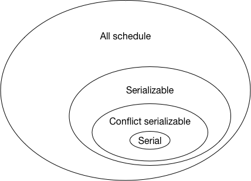
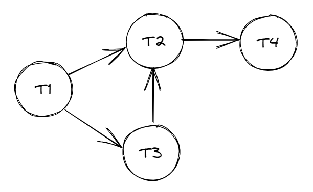
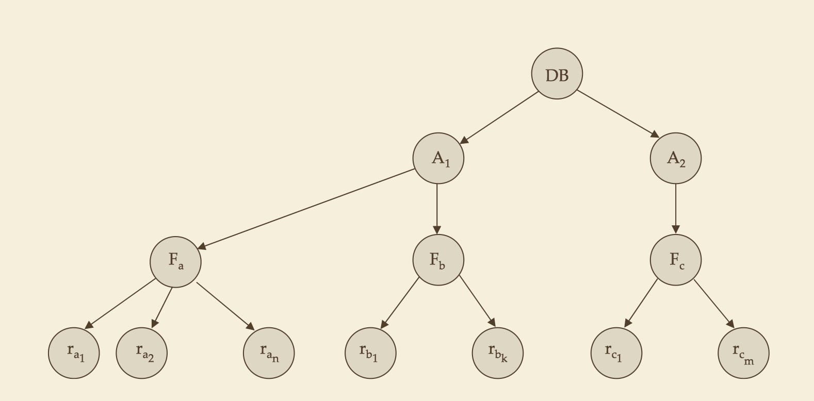

# 事务管理

## 事务

通常，从数据库用户的角度来看，数据库中一些操作的集合被认为是一个独立单元。例如，从顾客的立场来看，从支票账户到储蓄账户的资金转账是一次单一的操作；而在数据库系统中，这是由几个操作组成的。这样数据库中构成单一逻辑单元的操作集合被称作**事务**。

事务具有 **ACID 特性**：

* **原子性（atomicity）**：事务的所有操作在数据库中要么全部反映出来，要么全部不反应。
* **一致性（consistency）**：隔离执行事务时（在没有其他事务并发的情况下），数据库保持一致性。
* **隔离性（isolation）**：尽管多个事务并发执行，但是每个事务都感觉不到系统中有其他事务并发的执行。
* **持久性（durability）**：一个事务成功完成后，它对数据库的改变必须是永久的，即使出现系统故障。

其中**一致性**强调的更多的事务前后数据库**状态**的一致性，如果数据库在事务执行前是一致的，那么事务执行后数据库仍将保持一致。确保单个事务的一致性是编写该事务的应用程序员的责任，完整性约束的自动检查给这项工作带来了便利。

**原子性**指的是这个事务操作本身要么全部执行要么全部不执行。如果数据库出现故障，比如停电，此时数据库将会出现**不一致状态**，我们必须保证这种不一致性在数据库中是不可见的。这就是需要原子性的原因：如果具有原子性，某个事务的所有动作要么在数据库中全部反映出来（事务已提交），要么全部不反映（事务未提交，包括数据库出现故障）。这项工作由**恢复系统**来完成，后面将会介绍。

事务的**持久性**保证一旦事务成功完成.该事务对数据库所做的所有更新就都是持久的，即使事务执行完成后出现系统故障。这项工作同样是由**恢复系统**来完成的。

对于**隔离性**，如果几个事务并发地执行，即使每个事务都能确保一致性和原子性，它们的操作会以人们所不希望的某种方式交叉执行，这也会导致不一致的状态。

### 事务的隔离性

为了保证事务的隔离性，最简单的做法是**串行地（serially）**执行事务，但是为了**提高吞吐量和资源利用率**、**减少等待时间**，数据库往往会允许多个事务并发的执行。但是当并发执行多个事务时，由于事务中操作顺序的不同，往往会引起数据一致性的复杂问题，即违背了事务的隔离性。数据库系统必须控制事务之间的交互，以防止它们破坏数据库的一致性。系统通过称为**并发控制机制（concurrency-control scheme）**的一系列机制来保证这一点。后面将研究并发控制机制，现在我们集中考虑正确的并发执行这一概念。 

我们把并发事务中 SQL 语句的执行顺序称为**调度**，它们表示指令在系统中执行的时间顺序。比如 *T~1~* 和 *T~2~* 两个事务，先执行完 *T~1~* 的全部指令再执行 *T~2~* 的全部指令（调度 1）、执行完 *T~2~* 的全部指令再执行 *T~1~* 的全部指令（调度 2）、以及 *T~1~* 的指令和 *T~2~* 的指令以某种顺序交叉执行（调度 3），分别属于不同的调度。

最简单的保证事务正确性的就是**串行调度（serial schedule）**。即不允许事务并行执行，数据库同一个时刻只有一个事务正在执行，所有事务排队，一个接着一个的串行执行。这样很明显可以保证事务的正确性，但是效率低也是显而易见的。

### 可串行化

为了提高数据库的执行效率，我们没办法让事务完全串行调度，我们需要让事务并发执行。如果存在调度 *S*，对于数据库的任何状态，其执行结果完全等价于另一个串行调度 *S'*，则称这样的调度为**可串行化调度（serializable schedule）**。因为串行化调度的结果一定是正确的，所以可串行化调度的结果也一定是正确的。相比于串行调度，可串行化调度的并发度大大的提升了，但是在并发控制中却不太能去验证一个调度是否是可串行化调度，因为我们无法去通知执行该调度和串行调度去比较它们的执行结果。所以我们需要一个更易于验证的条件去保证这个调度是可串行化的。

**冲突可串行化（conflict serializable）**就是这样的条件。首先给出**冲突（conflict）**的定义：当 *I* 与 *J* 是不同事务在相同的数据项（需要特别注意，这里的数据项不等同于一行数据，可能为一个条件范围，也可能是一张表）上的操作，并且其中至少有一个是 **write** 指令时，我们说 *I* 与 *J* 是冲突（conflict）的。 包括了 Read-Write conflict、Write-Read conflict 和 Write-Write conflict，实际上就是读写冲突和写写冲突。

当冲突发生，如果它们的顺序交换，则涉及到的事务中至少有一个的行为会改变。如果调度 *S* 可以通过一系列非冲突指令交换成 *S'*，我们称 *S* 和 *S'* 是**冲突等价**的，当 *S'* 为一个串行调度时，我们称 *S* 为一个**冲突可串行化调度（conflict serializable schedule）**。

冲突可串行化调度是可串行化调度的子集，它的意义在于相对于可串行化，冲突可串行化是一个更加容易验证的条件，因此更加适合作为事务并发控制的实现依据。事实上，现在隔离级别中常说的可串行化（serializable），其实是就是指冲突可串行化（conflict serializable）。

验证一个调度是否为冲突可串行化调度可以通过优先图和 Strict-2PL 来进行验证。这里先跳过。

### 隔离级别

可串行化固然会让用户感到安心，但是由于可串行化调度的验证方式往往伴随着大量的阻塞等待（比如 2PL），难以达到很高的事务并发执行性能。同时对于某些应用，保证可串行性的那些协议可能只允许极小的并发度。所以为了提供更好的并发执行性能，数据库不得不放宽调度的验证，允许更多非可串行化的调度被执行，这时我们采用较弱级别的一致性。

显然，多个并发的事务执行结果可能会不再等价于任何一种串行执行的结果，也就是说，事务不再是“隔离”的，事务之间相互产生了影响，导致结果出现了错误。从隔离的角度来看，这样的事务并发执行结果就是错误的，但却是为了提高性能不得不付出的代价。为了规范用户使用，数据库需要给用户做出保证：什么样的错误会发生，而什么样的错误不会发生，这些不同的保证，就是数据库的隔离级别。SQL 标准也允许一个事务这样规定：它可以以一种与其他事务不可串行化的方式执行。

SQL标准规定的隔离性级别如下：

- **可串行化（serializable）**：通常保证可串行化调度。然而，一些数据库系统对该隔离性级别的实现在某些情况下允许非可串行化执行。
- **可重复读（repeatable read）**：只允许读取已提交数据，而且在一个事务两次读取一个数据项期间，其他事务不得更新该数据。但该事务不要求与其他事务可串行化。例如：当一个事务在查找满足某些条件的数据时，它可能找到一个已提交事务插入的一些数据，但可能找不到该事务插入的其他数据。
- **已提交读（read committed）**：只允许读取已提交数据，但不要求可重复读。比如，在事务两次读取一个数据项期间，另一个事务更新了该数据并提交。
- **未提交读（read uncommitted）**：允许读取未提交数据。这是SQL允许的最低一致性级别。

以上所有隔离性级别都不允许**脏写（dirty write）**，即如果一个数据项已经被另外一个尚未提交或中止的事务写入，则不允许对该数据项执行写操作。 

下面给出四种隔离级别可能出现的现象。

| 隔离级别 | 脏读           | 不可重复读 | 幻读           | 串行化异常 |
| -------- | -------------- | ---------- | -------------- | ---------- |
| 未提交读 | 可能，PG不可能 | 可能       | 可能           | 可能       |
| 已提交读 | 不可能         | 可能       | 可能           | 可能       |
| 可重复读 | 不可能         | 不可能     | 可能，PG不可能 | 可能       |
| 可串行化 | 不可能         | 不可能     | 不可能         | 不可能     |

由于 Postgresql 的内部实现，它的未提交读和已提交读模式相同。

## 并发控制

并发控制机制的目的是获得高度的并发性，同时保证所产生的调度是**冲突可串行化**或**视图可串行化**的、**可恢复的**，并且是**无级联的**。

并发控制机制主要包括**封锁**、**时间戳**、以及**多版本并发控制（MVCC）**。没有哪种机制是明显最好的；每种机制都有优势。在实践中，最常用的机制有**两阶段封锁**和**快照隔离**。Postgresql 采用的是两阶段封锁和 MVCC 相结合的方式来满足事务要求的。

### 基于锁的协议

事务对数据的访问和修改都必须先加锁，在这里我们先只考虑两种锁：

* **共享型锁（shared-mode lock）**，记为 S。如果事务 *T~i~* 获得了数据项 *Q* 上的共享型锁，则 *T~i~* 可读但不能写 *Q*。
* **排他型锁（exclusive-mode lock）**，记为 X。如果事务 *T~i~* 获得了数据项 *Q* 上的排他型锁，则 *T~i~* 既可读又可写 *Q*。

相容矩阵如下：

|       | S     | X     |
| ----- | ----- | ----- |
| **S** | true  | false |
| **X** | false | false |

#### 三级封锁协议

三级封锁协议用于解决修改丢失、不可重复读和读脏数据问题，解决问题的焦点是**给数据库对象何时加锁、加什么样的锁**。封锁协议级别越高，一致性程度越高。

|              | 修改数据                                      | 读取数据                                      |
| ------------ | --------------------------------------------- | --------------------------------------------- |
| 一级封锁协议 | 修改数据必须加 *X* 锁，直到事务结束时才释放。 | 读取数据不必加锁。                            |
| 二级封锁协议 | 修改数据必须加 *X* 锁，直到事务结束时才释放。 | 读取数据必须加 *S* 锁，读完即可释放。         |
| 三级封锁协议 | 修改数据必须加 *X* 锁，直到事务结束时才释放。 | 读取数据必须加 *S* 锁，直到事务结束时才释放。 |

下面给出一个表格解释了它们分别解决了什么问题。

|              | 修改丢失 | 脏读   | 不可重复读 |
| ------------ | -------- | ------ | ---------- |
| 一级封锁协议 | 解决     | 未解决 | 未解决     |
| 二级封锁协议 | 解决     | 解决   | 未解决     |
| 三级封锁协议 | 解决     | 解决   | 解决       |

> 注意区分三级封锁协议和后面的两阶段封锁协议，它们的关注点不同。
>
> 三级封锁协议**不能保证**并发操作下事务最终的执行结果和这些事务**串行**的某个执行结果一致（如有事务 *T~1~* 和事务 *T~2~*，串行先执行 *T~1~* 执行完成再执行 *T~2~* 或者串行先执行 *T~2~* 执行完成再执行 *T~1~*，两次结果中的某一次结果一致即可）。
>
> 两段锁协议解决的是**事务调度问题**，解决问题的方法是将加锁和锁的释放分为两个阶段，加锁阶段只加锁不释放，只要一个锁开始释放，进入释放阶段，只释放，不加锁，两段锁协议是确保执行结果和这些事务串行的某个执行结果一致的充分条件。

#### 两阶段封锁协议

保证**可串行化**的一个协议是**两阶段封锁协议（two-phase locking protocol, 2PL）**。该协议要求每个事务分成两个阶段提出加锁和解锁的申请：

1. **增长阶段（growing phase）**：事务可以获得锁，但不能释放锁。
2. **缩减阶段（shrinking phase）**：事务可以释放锁，但不能获得新锁。 

最初，事务处于增长阶段，事务根据需要获得锁。一旦该事务释放了锁，它就进入了缩减阶段， 并且不能再发出加锁请求。 对于任何事务，在调度中该事务获得其最后加锁的位置（增长阶段结束点）称为事务的**封锁点（lock point）**。

两阶段封锁协议仍然会发生死锁的级联回滚，**级联回滚**可以通过将两阶段封锁修改为**严格两阶段封锁协议（strict two-phase locking protocol, Strict-2PL）**加以避免。这个协议除了要求封锁是两阶段之外，还要求事务持有的所有排他锁必须在事务提交后方可释放。这个要求保证未提交事务所写的任何数据在该事务提交之前均以排他方式加锁，防止其他事务读这些数据。

另一个两阶段封锁的变体是**强两阶段封锁协议（rigorous two-phase locking protocol）**，它要求事务提这些数据交之前不得释放任何锁。使用锁机制的数据库系统，要么使用严格两阶段封锁协议，要么使用强两阶段封锁协议。

#### 死锁处理

不管是三级封锁协议还是两阶段封锁协议，它们都可能造成死锁问题。处理死锁问题主要有两个方法：**死锁预防**和**死锁检测与恢复**。

##### 死锁预防

死锁预防主要有两个方法：

1. 在事务开始之前封锁它的所有数据项，或对加锁请求进行排序。
2. 每当等待可能导致死锁时，进行事务回滚而不是等待加锁。

其中第一种方法不做介绍，这里主要介绍第二种方法。

第二种方法主要使用抢占和事务回滚，只要当事务申请锁的时候阻塞等待了，那么回滚其中事务。为控制抢占，我们给每 个事务赋一个唯一的时间戳，系统仅用时间戳来决定事务应当等待还是回滚。比如，存在两个事务 *T~i~* 和 *T~j~*（*T~i~* 的时间戳 < *T~j~* 的时间戳，即 *T~i~* 比 *T~j~* 老），事务 *T~i~* 已经持有资源 *A* 的 *X* 锁，事务 *T~j~* 此时也去申请资源资源 *A* 的 *X* 锁那么便会阻塞，这个时候就需要去回滚其中一个事务了。如果使用非抢占技术 **wait-die**，那么回滚新的事务 *T~i~*；如果使用抢占技术 **wound-wait**，那么回滚老的事务 *T~j~*。

另一种处理死锁的简单方法基于锁超时，该机制介于死锁预防 （不会发生死锁）与死锁检测及恢复之间。在这种方法中，申请锁的事务至多等待一段给定的时间。若在此期间内未授予该事务锁，则称该事务超时，此时该事务自己回滚并重启。如果确实存在死锁，卷入死锁的一个或多个事务将超时并回滚，允许其他事务继续。

##### 死锁检测与恢复

死锁的检测通过检查**等待图**是否有环来判断。等待图是一个有向图，该图由 *G* =（*V*, *E*）对组成，其中 *V* 是顶点集，*E* 是边集。顶点集由系统中的所有事务组成，边集的每一元素是一个有序对 *T~i~*→*T~j~*。如果 *T~i~*→*T~j~* 属于 *E*，则存在从事务 *T~i~* 到 *T~j~* 的一条有向边，表示事务 *T~i~* 在等待 *T~j~* 释放所需数据项。 

比如：

* 事务 *T~1~* 在等待 *T~2~* 、 *T~3~*。
* 事务 *T~2~* 在等待 *T~4~*。
* 事务 *T~3~* 在等待 *T~2~*。

由于该等待图无环，所以系统没有出现死锁状态。如果等待关系 *T~4~*→*T~3~* 被加入等待图中，此时等待图包含环 *T~3~*→*T~2~*→*T~4~*→*T~3~*，意味着 *T~2~*、*T~3~* 和 *T~4~* 都处于死锁状态。

>  由此引出一个问题：何时激活死锁检测算法？答案取决于两个因素：
>
> 1. 死锁发生的频率？
> 2. 有多少事务受到死锁的影响？
>
> 如果死锁频繁发生，则检测算法应比通常情况下激活得更频繁，分配给处于死锁状态的事务的数据项在死锁解除之前不能为其他事务获取。此外，等待图中环的数目也可能增大。在最坏的情况下，我们要在每个分配请求不能立即满足时激活检测算法。

当死锁检测算法判定系统中存在死锁时，系统必须通过回滚一个或多个事务来从死锁状态中**恢复**。恢复时需要考虑两个因素：

1. **选择牺牲者**。给定处于死锁状态的事务集，为解除死锁，我们必须决定回滚哪一个或哪一些事务以打破死锁。我们应使事务回滚带来的代价最小。如果选择牺牲者的时候主要考虑的是代价因素，那么有可能出现**饿死**，即某一个事务永远无法获取锁。这个时候我们需要在代价因素中包含回滚次数。
2. **回滚距离**。最简单的方法是**彻底回滚**，中止该事务，然后重新开始。然而，事务只回滚到可以解除死锁处会更有效。这种**部分回滚**要求系统维护所有正在运行事务的额外状态信息。

#### 多粒度封锁

为了支持多粒度封锁我们引入了一种新的锁类型：**意向锁类型（intention lock mode）**。

在前面的内容中，我们将一个个数据项作为进行同步执行的单元。 然而，某些情况下需要把多个数据项聚为一组，将它们作为一个同步单元，因为这样会更好。比如当事务想锁住一个表的时候，事务需要为这个表中的每一个元组加锁。显然这个操作是十分费时的。在数据库中的数据根据数据的粒度可以划分为如下的树状结构图：

由于我们支持多粒度加锁，所以我们可以对树状图中的每一个节点都进行加锁。

当没有意向锁的时候，如果事务 *T~1~* 对 *F~b~* **显式**地加了 *X* 锁，那么实际上事务 *T~1~* 对 *F~b~* 的两个子节点都**隐式**地加 *X* 锁，因此没必要再对 *F~b~* 的两个子节点去分别加锁了。

如果事务 *T~2~* 此时想对 *r~bk~* 显示的加 *X* 锁，那么事务 *T~2~* 需要从跟节点到 *r~bk~* 进行遍历，只有当现此路径上所有结点与当前节点要加的锁类型相容时才能申请成功。由于当前 *F~b~* 中存在 *X* 锁，所有事务 *T~2~* 延迟。到这里是没有问题的。

而如果事务 *T~3~* 想对封锁整个数据库，那么它需要根节点 *DB* 进行加锁。而由于事务 *T~1~* 已经对 *F~b~* **显式**地加了 *X* 锁，所以事务 *T~3~* 的加锁是不会成功的。那么系统该如何进行判定呢？一种办法是遍历根节点的所有孩子节点，但是这与引入多粒度封锁机制的初衷相悖。所以由此我们引入了**意向锁**。

如果一个结点加上了意向锁，则意味着要在树的较低层进行显式加锁（也就是说，以更小的粒度加锁）。在一个结点显式加锁之前，该结点的全部祖先结点均加上了意向锁。因此，事务不必搜索整棵树就能判定能否成功地给一个结点加锁。希望给某个结点（如 *Q*）加锁的事务必须遍历从根到 *Q* 的路径。在遍历树的过程中，该事务给各结点加上意向锁。 

与共享锁相关联的是一种意向锁，与排他锁相关联的是另一种意向锁。如果一个结点加上了**共享型意向**（IS）锁，那么将在树的较低层进行显式封锁，但只能加共享锁。类似地，如果一个结点加**排他型意向**（IX）锁，那么将在树的较低层进行显式封锁，可以加排他锁或共享锁。最后，若一个结点加上了**共享排他型意向锁**（SIX），则以该结点为根的子树显式地加了共享锁，并且将在树的更低层显式地加排他锁。这些锁类型的相容函数如下表所示：

|         | IS    | IX    | S     | SIX   | X     |
| ------- | ----- | ----- | ----- | ----- | ----- |
| **IS**  | true  | true  | true  | true  | false |
| **IX**  | true  | true  | false | false | false |
| **S**   | true  | false | true  | false | false |
| **SIX** | true  | false | false | false | false |
| **X**   | false | false | false | false | false |

多粒度协议要求加锁按自顶向下的顺序（根到叶），而锁的释放则按自底向上的顺序（叶到根）。与在两阶段封锁协议中一样，在多粒度协议中也可能存在死锁。

回到之前的例子，当存在意向锁的时候，事务 *T~1~* 对 *F~b~* **显式**地加了 *X* 锁，那么事务 *T~1~* 需要从根节点遍历到 *F~b~* 的父节点，并且遍历的过程中依次加 *IX* 锁。当全获取成功时，对 *F~b~* 加上 *X* 锁。

事务 *T~2~* 此时要对 *r~bk~* 显示的加 *X* 锁，那么事务 *T~1~* 需要从根节点遍历到 *r~bk~* 的父节点，并依次加上 *IX* 锁。*F~b~* 的 *X* 锁与当前事务的 *IX* 锁锁冲突了，因此事务 *T~2~* 需要延迟。

当事务 *T~3~* 想对封锁整个数据库时，它直接对根节点加上上 *X* 锁，而由于根节点上已经有 *IX* 锁了，所以事务 *T~3~* 获取锁失败。

### 基于时间戳的协议

上面的封锁协议，每一对冲突事务的次序都是通过在执行时对锁的申请，第一个类型不相容的锁的申请顺序决定的。而时间戳排序机制是一种事先就可以决定事务的可串行化顺序的方式。

系统为每一个事务 *T~i~* 都分配一个唯一的时间戳，这个时间戳可以使用**系统时间**或者**逻辑计数器**。事务的串行化顺序由时间戳的顺序来决定。因此，若 TS(*T~i~*) < TS(*T~j~*)，则系统必须保证所产生的调度等价于事务 *T~i~* 出现在事务 *T~j~* 之前的某个串行调度。

除此之外，对于每一个数据项 *Q* 都有两个时间戳，**W-timestamp**(*Q*) 和 **R-timestamp**(*Q*)。

* **W-timestamp**(*Q*) 表示成功执行 **write**(*Q*) 的所有事务的最大时间戳。
* **R-timestamp**(*Q*) 表示成功执行 **read**(*Q*) 的所有事务的最大时间戳。

每当有新的 **write**(*Q*) 或 **read**(*Q*) 指令执行时，这些时间戳就更新。

**时间戳排序协议（timestamp-ordering protocol）**保证任何有冲突的 **read** 或 **write** 操作按时间戳顺序执行。该协议运作方式如下：

1. 假设事务 *T~i~*，发出 **read**(*Q*)。
    1. 若 TS(*T~i~*) < W-timestamp(*Q*)，则 *T~i~*，需要读入的 *Q* 值已被覆盖。因此，read 操作被拒绝，*T~i~* 回滚。
    2. 若 TS(*T~i~*) ≥ W-timestamp(*Q*)，则执行 read 操作，R-timestamp(*Q*) 被设置为 R-timestamp(*Q*) 与 TS(*T~i~*) 两者的最大值。
2. 假设事务 *T~i~*，发出 **write**(*Q*)。
    1. 若 TS(*T~i~*) < R-timestamp(*Q*)，则 *T~i~* 产生的 *Q* 值是先前所需要的值，且系统已假定该值不会再产生。因此，write 操作被拒绝， *T~i~* 回滚。
    2. 若 TS(*T~i~*) < W-timestamp(*Q*)，则 *T~i~* 试图写入的 *Q* 值已过时。因此，write 操作被拒绝， *T~i~* 回滚。
    3. 其他情况（事务比数据项读写时间戳都新），系统执行 write 操作，将 W-timestamp(*Q*) 设置为 TS(*T~i~*)。

如果事务 *T~i~* 由于发出 **read** 或 **write** 操作而被并发控制机制回滚，则系统赋予它新的时间戳并重新启动。

### 基于有效性检查的协议

**有效性检查协议（validation protocol）**是一种**乐观的并发控制机制（(optimistic concurrency control）**，之前的封锁以及时间戳排序都是悲观的，因为当它们检测到一个冲突时，它们强迫事务等待或回滚，即使该调度有可能是冲突可串行化。在大部分事务都是只读事务的情况下，事务发生冲突的概率很低。如果在这种情况下我们仍然采用一种悲观的协议，那么对数据库系统对造成较大的开销。因此有效性检查协议应运而生。

有效性检查协议将只读事务分为两个阶段、写事务分为三个阶段。他们按如下顺序进行：

1. **读阶段（read phase）**：在这一阶段中，系统执行事务 *T~i~*。各数据项值被读入并保存在事务 *T~i~* 的 局部变量中。所有 **write** 操作都是对局部临时变量进行的，并不对数据库进行真正的更新。
2. **有效性检查阶段（validation phase）**：对事务 *T~i~* 进行有效性测试。判定是否可以 执行 **write** 操作而不违反可串行性。如果事务有效性测试失败，则系统终止这个事务。
3. **写阶段（write phase）**：若事务 *T~i~* 已通过有效性检查（第2步），则保存 *T~i~* 任何写操作结果的临时局部变量值被复制到数据库中。只读事务忽略这个阶段。 

每个事务必须按以上顺序经历这些阶段。然而，并发执行的事务的三个阶段可以是交叉执行的。为进行有效性检测，我们需要知道事务 *T~i~* 的各个阶段何时进行。为此，我们将三个不同的时间戳与事务 *T~i~* 相关联。

- **Start(*T~i~*)**：事务 *T~i~* 开始执行的时间。
- **Validation(*T~i~*)**：事务 *T~i~* 完成读阶段并开始其有效性检查的时间。
- **Finish(*T~i~*)**：事务 *T~i~* 完成写阶段的时间。

我们利用时间戳 Validation(*T~i~*) 的值，通过时间戳排序技术决定可串行性顺序。因此值 TS(*T~i~*) = Validation(*T~i~*)，并且如果 TS(*T~j~*) < TS(*T~k~*)，则产生的任何调度必须等价于事务 *T~j~* 出现在 *T~k~* 之前的某个串行调度。选择 Validation(*T~i~*) 而不是 Finish(*T~i~*) 的原因是因为读阶段也会耗时，所以选择读阶段完成后的 Validation(*T~i~*) 能有更快的响应时间。

事务 *T~i~* 的**有效性测试（validation test）**要求任何满足 TS(*T~k~*) < TS(*T~i~*) 的事务 *T~k~* 必须满足下面两条件之一：

1. **Finish(*T~k~*) < Start(*T~i~*)**。因为 *T~k~* 在 *T~i~* 开始之前完成其执行，所以可串行性次序得到了保证。
2. ***T~k~* 所写的数据项集与 *T~i~* 所读数据项集不相交**，并且 **Start(*T~i~*) < Finish(*T~k~*) < Validation(*T~i~*)**。这个条件保证 *T~k~* 与 *T~i~* 的写不重叠。因为 *T~k~* 的写不影响 *T~i~* 的读，又因为 *T~i~* 不可能影响 *T~k~* 的读，从而保证了可串行性次序。

有效性检查机制自动预防级联回滚，因为只有发出写操作的事务提交后实际的写才发生。然而，存在长事务饿死的可能，原因是一系列冲突的短事务引起长事务反复重启。为了避免饿死，与之冲突的事务应当暂时阻塞，以使该长事务能够完成。 

### 多版本并发控制

在**多版本并发控制**（multiversion concurrency control, **MVCC**）机制中，数据库同时存在数据库中数据的多个版本，每个 **write(*Q*)** 操作创建一个新的副本，**read**(*Q*) 操作选择其中的一个版本来读取。每个事务都拥有一个数据库中所有数据的副本。

有多种方案来实现多版本并发控制，包括：多版本时间戳排序、多版本两阶段封锁、快照隔离。

#### 多版本时间戳排序

时间戳排序协议可以拓展为多版本的协议。对于每个事务都有一个唯一的时间戳与之对应，记为 TS(*T~i~*)。对于每一个数据项 *Q*，有一个版本序列 < *Q~1~*，*Q~2~*，……，*Q~m~* > 与之关联，每个版本的 *Q~K~* 包含三个数据字段：

- **Content** 是 *Q~k~* 版本的值。
- **W-timestamp(*Q*)** 是创建 *Q~k~* 版本的事务的时间戳。
- **R-timestamp(*Q*)** 是所有成功地读取 *Q~k~* 版本的事务的最大时间戳。

事务（如 *T~i~*）通过发出 **write(*Q*)** 操作创建数据项 *Q* 的一个新版本 *Q~k~*，版本的 content 字段保存事务 *T~i~* 写入的值，系统将 W-timestamp与 R-timestamp 初始化为 TS(*T~i~*)。每当事务 *T~i~* 读取 *Q~k~* 的值且 R-timestamp(*Q~k~*) < TS(*T~i~*) 时，R-timestamp 的值就更新 

下面展示的**多版本时间戳排序机制（multiversion timestamp-ordering scheme）**保证可串行性。该机制运作如下：假设事务 *T~i~* 发出 **read(*Q*)** 或 **write(*Q*)** 操作，令 *Q~k~* 表示 *Q* 满足如下条件的版本，其写时间戳是小于或等于 TS(*T~i~*) 的最大写时间戳。

1. 如果事务 *T~i~* 发出 **read(*Q*)**，则返回值是 *Q~k~* 的内容。
2. 如果事务 *T~i~* 发出 **write(*Q*)**，且若 TS(*T~i~*) < R-timestamp(*Q~k~*)，则系统回滚事务 *T~i~*，另一方面若 TS(*T~i~*) < W-timestamp(*Q~k~*)，则系统覆盖 *Q~k~* 的内容；否则（若 TS(*T~i~*) > R-timestamp(*Q~k~*)）,创建 *Q* 的一个新版本。

不再需要的版本根据以下规则删除：假设有某数据项的两个版本 *Q~k~* 与 *Q~j~*，这两个版本的 W-timestamp 都小于系统中最老的事务的时间戳，那么 *Q~k~* 与 *Q~j~* 中较旧的版本将不会再用到，因而可以删除。

#### 多版本两阶段封锁

**多版本两阶段封锁协议（multiversion two-phase locking protocol）**希望将多版本并发控制的优点与两阶段封锁的优点结合起来。该协议对**只读事务（read-only transaction）**与**更新事务（update transaction）**加以区分。

更新事务执行强两阶段封锁协议；即它们持有全部锁直到事务结束。因此，它们可以按提交的次序进行串行化。数据项的每个版本有一个时间戳，这种时间戳不是真正基于时钟的时间戳，而是一个计数器，我们称之为 **ts-counter**，这个计数器在提交处理时增加计数。 

只读事务在开始执行前，数据库系统读取 **ts-counter** 的当前值来作为该事务的时间戳。只读事务在执行读操作时遵从多版本时间戳排序协议。因此，当只读事务 *T~i~* 发出 **read(*Q*)** 时，返回值是小于 TS(*T~i~*) 的最大时间戳的版本的内容。

当更新事务读取一个数据项时，它在获得该数据项上的共享锁后读取该数据项最新版本的值。当更新事务想写一个数据项时，它首先要获得该数据项上的排他锁，然后为此数据项创建一个新版本。写操作在新版本上进行，新版本的时间戳最初置为 ∞，它大于任何可能的时间戳值。

当更新事务 *T~i~* 完成其任务后，它按如下方式进行提交：首先，*T~i~* 将它创建的每一版本的时间戳设置为 **ts-counter** 的值加 1；然后 *T~i~* 将 **ts-counter** 增加 1。在同一时间内只允许有一个更新事务进行提交。

这样，在 *T~i~* 增加了 **ts-counter** 之后启动的只读事务将看到 *T~i~* 更新的值，而那些在 *T~i~* 增加 **ts-counter** 之前就启动的只读事务将看到 *T~i~* 更新之前的值。无论哪种情况，只读事务均不必等待加锁。多版本两阶段封锁也保证调度是可恢复的和无级联的。

版本删除类似于多版本时间戳排序中采用的方式。假设有某数据项的两个版本 *Q~k~* 与 *Q~j~*，两个版本的时间戳都小于或等于系统中最老的只读事务的时间戳。则两个版本中较旧的将不会再使用，可以删除。

### 快照隔离

快照隔离是一种特殊的并发控制机制，并且在商业和开源系统中广泛接受，包括 Oracle、PostgreSQL 和 SQL Server。

## 恢复系统

暂未阅读
