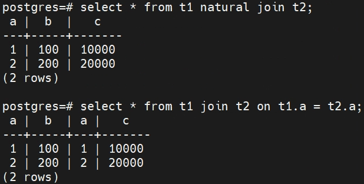

# 关系数据库

## 关系模型介绍

关系型数据库由**表（table）**的集合构成

**n 元组（n-tuple）**表示有 n 个值的元组，对应于表中的一行。

**关系代数**定义了在关系上的一组运算，对应于作用在数字上的普通代数运算，如加法、减法或乘法。正如作用在数字上的代数运算以一个或多个数字作为输入，返回一个数字作为输出，关系代数运算通常以一个或两个关系作为输入，返回一个关系作为输出。

下面我们给出几个运算的概述：


## SQL

> DDL（data definition language）数据库定义语言
>
> DML（data manipulation language）数据操纵语言
>
> DCL（Data Control Language）数据库控制语言

### SQL 查询基本结构

SQL 查询的基本结构由三个子句构成：**select**、**from** 和 **where**。查询的输入是在 **from** 子句中列出的关系，在这些关系上进行 **where** 和 **select** 子句中指定的运算，然后产生一个关系作为结果。

一个典型的SQL查询具有如下形式：

```sql
select A1, A2, ……, An 
from r1, r2, ……, rn
where P； 
```

每个 *A~i~* 代表一个属性，也称作投影列；每个 *r~i~* 代表一个关系；*P* 是一个谓词，也即查询条件。

在 **select** 后 加入 **distinct** 可以去除结果集中重复的元组。在属性名、关系名后添加 **as** 可以做更名运算。

### 集合运算

包括了 **union**、**intersect** 和 **except** 运算，对应数学中的的并、交和差运算。**union**、**intersect** 和 **except** 都会自动去重（在去重机制上与 **distinct** 相同，主要体现在对 **null** 的处理上），如果想保留重复的那么需要使用 **union all**、**intersect all **和 **except all**。**union all** 会保留所有的重复数据，**intersect all** 会保留重复次数最少的那个，而 **except all** 保留的重复次数为二者的差值。

### 空值

由于 SQL 中存在 **null**，所以在关系运算需要处理很多特殊的问题。如 `1 < null`，它的结果既不能说是真也不能说是假，因为我们不知道空值代表什么。如果上面的式子说是假，那么 `not (1 < null)`就应该说是真的，但是这是没有意义的。所以 **where** 子句中的谓词结果存在 **true**、**false **和 **unknown** 三种结果。SQL 中引入了 **boolen** 类型，它可以同样取三个值：**true**、**false** 和 **unknown**。

- **and**：*true* **and** *unknown* 的结果是 *unknown*，*false* **and** *unknown* 结果是 *false*，*unknown* **and** *unknown* 的结果是 *unknown*。
- **or**： *true* **or** *unknown* 的结果是 *true*，*false* **or** *unknown* 结果是 *unknown*，*unknown* **or** *unknown* 结果是 *unknown*。
- **not**：**not** *unknown* 的结果是 *unknown*。

总结起来就是 `false and unkown = false`，`true or unkown = true`，其他情况下结果都为 known。而如果要判断为空值，则 SQL应写为 **is null** 和 **is not null**。某些 SQL 还允许使用 **is known** 和 **is not known** 去判断结果是否为 known。

而在 **select distinct** 中子句中，对于重复元组将会被去除。当比较两个元组对应的属性值时，如果这两个值都是非空且相等，或者都为空，那么它们便是相同的，此时 **distinct** 将只会保留他们的一份拷贝。注意上述对待空值的方式与谓词中对待空值的方式是不同的，在谓词中 `null = null` 会返回 unknown，而不是 true。

### 聚集函数

#### 基本聚集

聚集函数是指以一个集合为输入、返回单个值的函数。SQL提供了五个固有的聚集函数 **avg**、**min**、**max**、**sum **和 **count**，其中**avg** 和 **sum** 的输入集必须是数字集。比如对于的下面表，我们可以使用如下SQL语句来获得员工的平均薪水：

```sql
create table employee (ID int, dept_name varchar(50), age int, salary int);
select avg(salary) from employee;
```

它把获取集合作为一组数据输入给了聚集函数 **avg** 中，获取单个值的输出结果。

#### 分组聚集

我们可以通过 **group by** 子句来实现分组查询。比如，下面的 SQL 可以获取每个部门的平均薪水：

```sql
select avg(salary) as avg_salary
from employee
group by dept_name;
```

这里是把集合按照 **group by** 子句的内容分成多个组，输入给 **avg**，分别获取多个值作为结果。在我们分组的时候，任何没有出现在 **group by** 子句中的属性如果出现在 **select** 子句中的话，它只能出现在聚集函数内部，否则这样的查询就是错误的。因为在每个组我们的输出结果只有一条元组，而这个属性可能有多个不同的值。比如下面的 SQL 就是错误的。

```sql
select id, age, avg(salary) from employee group by dept_name;
-- 错误的SQL，因为每个分组中的每一个员工都有不同的id和age，当我们作为一个分组最后只输出一条元组时，我们无法选定哪个id和age作为输出。其结果是，SQL不允许这样的情况出现。
```

#### having 子句

**having** 子句可以对分组后的结果进行选择。与 **where** 子句相比，**having** 子句的谓词在形成分组后才生效，因此可以使用聚集函数，而 **where** 子句中是不能用聚集函数的。我们用 SQL 表达该查询如下：

```sql
select dept_name, avg(salary) as avg_salary
from employee
group by dept_name
having avg(salary) > 10000;
```

与 **select** 子句类似，任何出现在 **having** 子句中，但是没有被聚集到的属性必须出现在 **group by** 子句中，否则该查询就会被当成是错误的。

包含聚集函数、**group by** 或者 **having** 子句的查询可以通过下列序列来定义操作：

1. 与不带聚集的查询情况类似，最先根据 **from** 子句来计算出一个关系。
2. 如果出现了 **where** 子句，**where** 子句中的谓词将应用到 **from** 子句的结果关系上。
3. 如果出现了 **group by** 子句，满足 **where** 谓词的元组通过 **group by** 子句形成分组。如果没有 **group by** 子句，满足 **where** 谓词的整个元组集被当作一个分组。
4. 如果出现了 **having** 子句，它将应用到每个分组上；不满足 **having** 子句谓词的分组将被抛弃。
5. **select** 子句利用剩下的分组产生出查询结果中的元组，即在每个分组上应用聚集函数来得到单个结果元组。 

#### 对空值和布尔值的聚集

聚集函数根据以下原则处理**空值**：除了 **count( * )** 外所有的聚集函数都忽略输入集合中的空值。由于空值被忽略，有可能造成参加函数运算的输入值集合为空集。规定空集的 **count** 运算值为 0，其他所有聚集运算在输入为空集的情况下返回一个空值。在一些更复杂的 SQL 结构中空值的影响会更难以琢磨。

对于**布尔（boolean）**数据类型，它可以取 **ture**、**false**、**unknown** 三个值。有两个聚集函数：**some** 和 **every**，其含义正如直观意义一样，可用来处理**布尔(boolean)**值的集合。

### 嵌套子查询

子查询是指嵌套在另一个查询中的 **select-from-where** 表达式。常见的子查询常常出现在 **from** 子句和 **where** 子句，也可以出现在 **select**、**having** 等子句中。其中外层的查询被叫做**父查询**，内层的查询被叫做**子查询**。使用了父查询相关名字的子查询被称作**相关子查询（Correlated Subqueries）**，没有使用父查询相关的子查询被称作**非相关子查询**。

在包含了子查询的查询中，在相关名称上可以应用作用域规则。根据此规则，在一个子査询中只能使用此子查询本身定义的，或者在包含此子查询的任何查询中定义的相关名称。如果一个相关名称既在子査询中定义，又在包含该子查询的查询中定义，则子査询中的定义有效。这条规则类似于编程语言中通用的变量作用域规则。 

为更好的举例说明，我们创建如下的两个表。

```sql
-- 部门信息
create table department (
    dept_name varchar(50) primary key,
    leader varchar(50),
    employee_count int
);
-- 员工信息
create table employee (
    ID int,
    dept_name varchar(50) references department(dept_name),
    age int,
    salary int
);
```

其中 **primary key** 表示该列是主键，**references** 表示该列是外键。一个表中的外键指向另一个表中的主键，是能确定另一张表记录的字段，用于保持数据的一致性。

#### where 子句中的嵌套子查询

可以用 **in**、**not in** 连接词来测试元组在关系中的成员资格。**in** 测试元组是否是集合中的成员，**not int** 测试元组是否不是集合中的成员。

```sql
-- 选择出领导为xxx的部门的所有员工ID
select ID
from employee
where dept_name in (
    select dept_name
    from department
    where leader = 'xxx'
);
-- 选择出不在A和B部门的员工ID
select ID
from employee
where dept_name not in ('A', 'B');
```

可以用 **some**（同 **any**）、**all** 关键字来对集合进行比较。**some** 表示结果集中的某一个（任意一个）元组，**all** 表示结果集中的所有元组。需要注意 **= some** 等价于 **in**，然而 **<> some** 不等价于 **not in**。类似的，**<>all** 等价于 **not in**，但是 **= all** 并不等价于 **in**。

```sql
-- 选择出工资至少比A部门中某一员工工资高的员工集合。
select ID
from employee
where salary > some (
    select salary
    from employee
    where dept_name = 'A'
);
-- 选择出工资比A部门所有员工都高的员工ID
select ID
from employee
where salary > all (
    select salary
    from employee
    where dept_name = 'A'
);
```

可以用 **exists** 结构来测试一个子查询的结果中是否存在元组，**exists** 结构在作为参数的子查询非空时返回 **true** 值。可以用 **not exists** 结构测试子查询结果集中是否不存在元组。

```sql
-- 筛选出年龄在50-60岁之间的员工
select ID
from employee as S
where age >= 50 and exists (
    select *
    from employee as T
    where age <= 60 and S.ID = T.ID
);
-- 等价于
select ID from employee where age between 50 and 60;
```

可以用 **unique** 结构和 **not unique** 来测试在一个子查询的结果中是否存在重复元组。如果作为参数的子查询结果中没有重复的元组，**unique** 结构将返回 **true** 值。目前很多数据库尚不支持该结构。

```sql
-- 筛选出最多只有一位年龄为50岁以上的员工的部门。
select dept_name
from department as S
where unique (
    select *
    from employee T
    where S.dept_name = T.dept_name
    and T.age > 50
);
```

#### from 子句中的嵌套子查询

SQL 允许在 **from** 子句中使用子查询表达式。在此采用的主要观点是：任何 **select-from-where** 表达式返回的结果都是关系，因而可以被插入到另一个 **select-from-where** 中任何关系可以出现的位置。

```sql
-- 找出平均工资大于10000的部门及平均工资
select * from (
    select dept_name, avg(salary) as avg_salary
    from employee
    group by dept_name
) where avg_salary > 10000;
```

#### with 子句

**with** 子句提供了定义临时关系的方法，这个定义只对包含 **with** 子句的查询有效。同样的查询我们也可以通过 **from** 或 **where** 子句中嵌套子查询来书写，但是 **with** 子句使得查询在逻辑上更加清晰，还允许在一个查询中多个地方使用 **with** 定义的临时关系。比如上面的 SQL 可以重写为如下形式：

```sql
-- 找出平均工资大于10000的部门及平均工资
with avg_salary (value) as (
    select dept_name, avg(salary) as avg_salary
    from employee
    group by dept_name
)
select *
from avg_salary
where value > 10000;
```

#### 标量子查询

SQL允许子查询出现在返回单个值的表达式能够岀现的任何地方，只要该子查询只返回包含单个属性的单个元组；这样的子查询称为**标量子查询(scalar subquery)**。 例如，一个子查询可以用到下面例子的 **select** 子句中：

```sql
-- 列出部门的名字、人数、平均工资
select dept_name, employee_count, (
    select avg(salary)
    from employee
    where employee.dept_name = department.dept_name
)
from department;
```

标量子查询可以出现在 **select**、**where** 和 **having** 子句中。也可以不使用聚集函数来定义标量子查询。在编译时并非总能判断一个子查询返回的结果中是否有多个元组，如果在子查询被执行后其结果中有不止一个元组，则产生一个运行时错误。 

注意从技术上讲标量子查询的结果类型仍然是关系，尽管其中只包含单个元组。然而，当在表达式中使用标量子査询时，它出现的位置是单个值出现的地方，SQL 就从该关系中包含单属性的单元组中取出相应的值，并返回该值。

## 中级 SQL

### 连接表达式

#### 笛卡尔积

通过 **from** 子句定义了一个在该子句中所列出关系上的笛卡儿积，形如 `from r1, r2, ……, rn`。此结果关系具有来自 **from** 子句中所有关系的所有属性。


此处使用的物理连接方式是**嵌套循环连接（Nested Loop Join）**。

#### 自然连接

**自然连接（natural join）**运算作用于两个关系，并产生一个关系作为结果。不同于两个关系上的笛卡儿积，它将第一个关系的每个元组与第二个关系的所有元组都进行连接；自然连接只考虑那些在两个关系模式中都出现的属性上取值相同的元组对，注意是所有都出现的属性。

以如下的表为例：

```sql
create table t1 (a int, b int);
create table t2 (a int, c int);
create table t3 (a int, b int, d int);
```

自然连接通过 **where** 来实现，可以写作：

```sql
 select * from t1, t2 where t1.a = t2.a;
```

同时可以更为简洁的写为：

```sql
select * from t1 natural join t2;
```

由于自然连接考虑的是所有出现的关系，所以对于下面的两条SQL语句他们的结果集并不相等。

```sql
select * from t1 natural join t2, t3 where t1.b = t3.b;
select * from t1 natural join t2 natural join t3;
```

因为 *t1* 和 *t2* 自然连接后出现的结果包括了 *(a, b, c)* 三个属性，而 *t3* 的属性为 *(a, b, d)*，所以作为这两个关系自然连接的结果既要在属性 *a*  上取值相同，又要在属性 *b* 上取值相同。为了发扬自然连接的优点，同时避免不必要的相等属性带来的危险，SQL 提供了一种自然连接的构造形式  **join … using **，允许用户来指定需要哪些列相等。所以下面的两个 SQL 是相等的：

```sql
select * from t1 natural join t2, t3 where t1.b = t3.b;
select * from (t1 natural join t2) join t3 using (b);
```

自然连接常用的物理连接方式为**哈希连接（Hash Join）**。

#### 外连接

首先介绍一下连接条件。上面介绍的 **nature** 和 **join … using** 是连接条件的一种，除此之外还有 **on** 条件，**on** 允许在参与连接的关系上设置通用的谓词。该谓词和 **where** 子句谓词很像，只不过使用的关键词是 **on** 而不是 **where**。

外连接包括了三种形式：

- **左外连接（left outer join）**只保留出现在左外连接运算之前(左边)的关系中的元组。
- **右外连接（right outer join）**只保留出现在右外连接运算之后(右边)的关系中的元组。
- **全外连接（full outer join）**保留出现在两个关系中的元组。 

相比而言，为了与外连接运算相区分，此前的不保留未匹配元组的连接运算被称作**内连接 （inner join）**运算。 

现在详细解释每种形式的外连接是怎样操作的。我们可以按照如下方式计算左外连接运算：首先，像前面那样计算出内连接的结果；然后，对于在内连接的左侧关系中任意一个与右侧关系中任何元组都不匹配的元组 *t*，向连接结果中加入一个元组 *r*，*r* 的构造如下：

* 元组 *r* 从左侧关系得到的属性被赋为 *t* 中的值。
* *r* 的其他属性被赋为空值。 

下面给出讨论过的所有连接类型和连接条件，任意的连接形式（内连接、左外连接、右外连接或全外连接）都可以和任意的连接条件（自然连接、**using** 条件连接或 **on** 条件连接）进行组合。


下面给出一些常见的问题：

> Q1：既然连接条件可以写在 **where** 子句里面，那么为什么还需要关键字 **on** 呢？
>
> 这是因为有两个原因：
>
> 1.  在 **on** 中指定连接条件比在 **where** 中更容易让人明白，更加清晰的表明这是表之间”做连接“的条件。
> 2.  在内连接中 **on** 和 **where** 的含义是一致的，但是对于外连接来说它们的表现是不一样的。
>
> 
>
> Q2：自然连接和内连接有什么关系？
>
> 自然连接和内连接的区别，在于对**重合的相同的部分**处理方式不同。
>
> 1. 自然连接的处理方式：既然重复了，就丢掉一份。
>
> 2. 内连接的处理方式：虽然重复，但两份都保留。
>
> 假设有 *t1*、*t2* 两个表，其中 *a* 字段是重复的：
>
> 
>
> 
>
> Q3：外连接归纳？
>
> 

### 视图

#### 定义视图

我们可以通过 `create view v as < query expression >` 来创建一个视图，其中` < query expression >` 可以是任何合法的查询语句。视图可以帮助我们隐藏特定的数据、也可以帮助我们整合不同表的数据提供给用户、还可以通过授予视图权限来更加精准的控制数据的访问。

#### 使用视图

在任何时候，视图中的数据都应该是当时表中数据的结果，如果预先把数据存在视图中，那么视图中的数据可能会过期。为了避免这样的情况，视图通常是这样实现的：当定义一个视图时，数据库系统存储的往往是视图定义本身（如 postgres 就可以在系统表 *pg_rules* 中找到），而不存储定义视图时查询表达式的执行结果。一旦视图出现在查询中， 它就被已存储的查询表达式代替。因此，无论我们何时执行这个查询，视图关系都被重新计算。

#### 更新视图

视图虽然是一个虚关系，但是它仍然可以被更新。视图的更新是复杂的，因为一个视图可能查询多个关系中的部分列，当我们更新视图时只能处理到这部分列的值，那么没有被视图包含的其他列就只能填充 *null*。考虑到完整性约束或者其他复杂的查询表达式，很多时候是不能够直接填充 *null* 的。

不同的数据库系统指定了不同的条件以允许更新视图关系。一般说来，如果定义视图的查询对下列条件都能满足，我们称 SQL 视图是可更新的（updatable）（即视图上可以执行 插入、更新或删除）：

- **from** 子句中只有一个数据库关系。
- **select** 子句中只包含关系的属性名，不包含任何表达式、聚集或 **distinct** 声明。
- 任何没有出现在 **select** 子句中的属性可以取空值；即这些属性上没有 **not null** 约束，也不构成主码的一 部分。
- 查询中不含有 **group by** 或 **having** 子句。 

在默认情况下，SQL 允许执行上述更新。但是，可以通过在视图定义的末尾包含 **with check option** 子句的方式来定义视图。这样，如果向视图中插入一条不满足视图的 **where** 子句条件的元组，数据库系统将拒绝该插入操作。类似地，如果新值不满足 **where** 子句的条件，更新也会被拒绝。

### 完整性约束

完整性约束保证授权用户对数据库所做的修改不会破坏数据的一致性。因此，完整性约束防止的是对数据的意外破坏。完整性约束通常被看成是数据库模式设计过程的一部分，它作为用于创建关系的 `create table` 命令的一部分被声明。然而，完整性约束也可以通过使用`alter table tablename add constraint`命令施加到已有关系上，其中 *constraint* 可以是关系上的任意约束。当执行上述命令时，系统首先保证关系满足指定的约束。如果满足，那么约束被施加到关系上；如果不满足，则拒绝执行上述命令。

#### 单个关系上的约束

包括 **not null**、**unique**、**primary key** 和 **check(P)**。

**not null** 表示这个属性禁止插入空值。

**unique** 表示这个属性唯一。同时它还支持 ***unique** (A~1~, A~2~, …, A~i~)* 的形式，即在关系中没有两个元组能在所有列出的属性上取值相同。

**primary key** 表示这是主键。一个关系中最多只能存在一个主键、它同时满足禁止插入空值且唯一。

**check(P)** 子句中指定一个谓词 *P*，关系中的每个元组都必须满足谓词 *P*，通常用 **check** 子句来保证属性值满足指定的条件。根据 SQL 标准，**check** 子句中的谓词可以是包括子査询在内的任意谓词。然而，当前还没有一个广泛使用的数据库产品允许包含子查询的谓词。 

下面给出一下示例：

```sql
create table student (
    name varchar(20) not null,
    budget numeric(12, 2) not null
);

create table section (
    course_id varchar (8),
    sec_id varchar (8),
    semester varchar (6),
    year numeric (4, 0),
    building varchar (15),
    room_number varchar (7),
    time_slot_id varchar (4),
    primary key (course_id, sec_id, semester, year),
    check (semester in ('Fall', 'Winter', 'Spring', 'Summer'))
);
```

#### 参照完整性

我们常常希望保证在一个关系中给定属性集上的取值也在另一关系的特定属性集的取值中出现这种情况称为**参照完整性（referential integrity）**。

外键可以通过 **references** 关键字和 **foreign key** 子句来实现。如之前的定义中的 `dept_name varchar(50) references department`，或者也可以写为 `foreign key (dept_name) references department`。

> 更一般地，令关系 *r~1~* 和 *r~2~* 的属性集分别为 *R~1~* 和 *R~2~*，主码分别为 *K~1~* 和 *K~2~*。如果要求对 *r~2~* 中任意元组 *t~2~* 均存在 *r~1~* 中任意元组 *t~1~* 使得如 *t~1~.K~1~=t~2~.α*，我们称的 *R~2~* 的子集 *α* 为参照关系 *r~1~* 中的  *K~1~*  的外码（foreign key）。

默认情况下，SQL 中外键参照的是被参照表中的主键属性。也可以显示的指定被参照关系的属性列表，然而这个指定的属性列表必须声明为被参照关系的候选码，要么使用 **primary key** 约束，要么使用 **unique** 约束。

当违反参照完整性约束时，通常的处理是拒绝执行导致完整性破坏的操作（即进行更新操作的事务被回滚）。但是，在 **foreign key** 子句中可以指明：如果被参照关系上的删除或更新动作违反了约束，那么系统必须采取一些步骤通过修改参照关系中的元组来恢复完整性约束，而不是拒绝这样的动作，比如 **on delete cascade** 和 **on update cascade**。如下所示：

```sql
create table employee (
    ...
    foreign key (dept_name) references department
        on delete cascade
        on update cascade,
    ...
);
```

由于有了与外码声明相关联的 **on delete cascade** 子句，如果删除 *department* 中的元组导致了此参照完整性约束被违反，则删除并不被系统拒绝，而是对 *employee* 关系作“级联”删除，即删除参照了被删除的元组。类似地，如果更新被参照字段时违反了约束，则更新操作并不被系统拒绝，而是将 *employee* 中参照的元组的 *dept_name* 字段也改为新值。SQL 还允许 **foreign key** 子句指明除 **cascade** 以外的其他动作，如果约束被违反：可将参照域（这里是 *dept_name*）置为 *null*（用 **set null** 代替 **cascade**），或者置为默认值（用 **set default**）。

## 高级 SQL

### 函数和过程

函数和过程允许“业务逻辑”作为存储过程记录在数据库中，并在数据库内执行。大多数数据库都实现了它们自己的非标准版本的语法，例如 Oracle(PL/SQL)、Microsoft SQL Sever(TransactSQL) 和 PostgreSQL(PL/pgSQL) 所支持的过程语言都与SQL标准所定义的语法有所差别，所以这里对语法不做介绍，可以去查看官方手册。

对于存储过程， 一般是用来完成特定的数据操作（比如修改、插入数据库表或执行某些DDL语句等等）；对于函数，一般情况下是用来计算并返回一个计算结果，比如 sum 这种函数。它们具体有如下区别：

| 过程                                                 | 函数                                                         |
| ---------------------------------------------------- | ------------------------------------------------------------ |
| 用于在数据库中完成特定的操作或者任务（如插入、删除） | 用于特定的数据（如选择）                                     |
| 可以作为一个独立的 PL/SQL 语句来执行                 | 不能独立执行，必须作为表达式的一部分调用                     |
| SQL语句（DML 或 SELECT）中不可调用存储过程           | SQL语句（DML 或 SELECT）中可以调用函数                       |
| 程序头部声明时不需要描述返回类型                     | 程序头部声明要描述返回类型，而且 PL/SQL 块中至少要包括一个有效的 return 语句 |

### 触发器

触发器可以用来实现未被SQL约束机制指定的某些完整性约束。它还是一种非常有用的机制，用来当满足特定条件时对用户发警报或自动开始执行某项任务。例如：假设一个仓库希望每种物品的库存保持一个最小量；当某种物品的库存少于最小值的时候，自动发出一个订货单。在更新某种物品的库存的时候，触发器会比较这种物品的当前库存和它的最小库存，如果库存数量小于或等于最小值，就会生成一个新的订单。

与函数和过程类似，大部分数据库实现的数据库语法与 SQL 标准定义的语法不同，可以查看官方手册。

触发器可以在（insert、delete、update、truncate 等）事件时触发，触发的时间包括了 before、after、instead of 等。在事件之前被执行的触发器可以作为避免非法更新、插入或删除的额外约束。为了避免执行非法动作而产生错误，触发器可以采取措施来纠正问题，使更新、插入或删除操作合法化。
